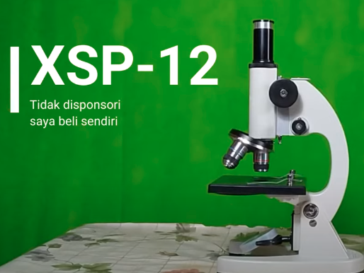
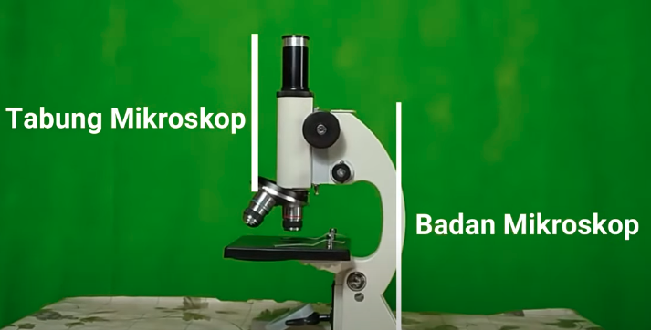
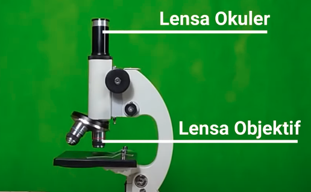
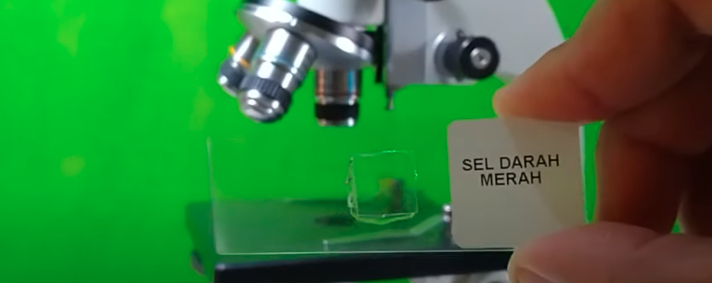
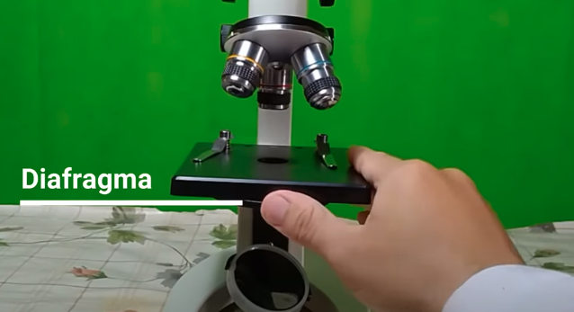
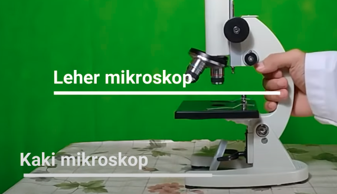
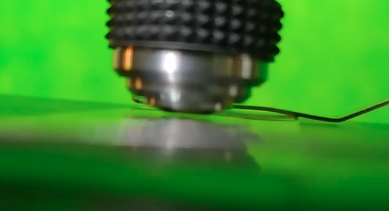
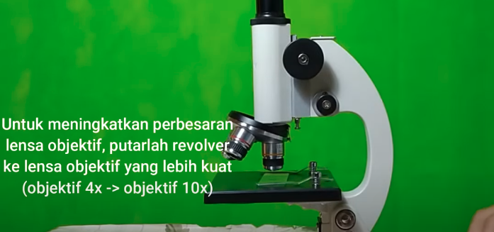
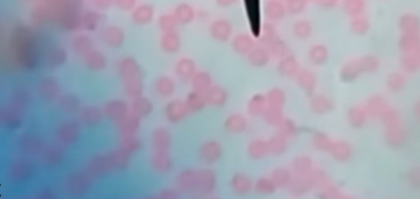

mikroskop berasal dari kata mikro (kecil) dan scpium (melihat). 

## bagian mikroskop

salah satu contoh mikroskop monokuler, binokuler berarti memiliki dua ruang penglihatan, dibagi menjadi dua bagian yaitu tabung mikroskop dan badan mikroskop

terdapat dua lensa pada tabung mikroskop yaitu lensa okuler, berada dekat dengan mata, dan lensa objektif, berada dekat dengan sampel

Membantu mendekatkan lensa ke sampel (preparat) menggunakan pemutar kasar, sedangkan untuk mengatur fokus lensa menggunakan pemutar halus. 

dibawah tepat meja preparat, ada sebuah alat untuk mengatur cahaya yang berasal dari cermin, dinamakan dengan diafragma. diafragma ini diatur sedemikian rupa dengan memutarnya sehingga didapatkan cahaya yang cukup

kemudian bagian selanjutnya adalah kaki mikroskop dan leher mikroskop sebagai tempat memegang mikroskop ketika akan dipindahkan, menggunakan tangan kanan, tangan satunya lagi memegan kaki mikroskop. 

## Penggunaan mikroskop
pastikan tabung mikroskop menggunakan terpasang lensa objective terkecil. posisikan mata pada lensa okuler, atur pencahayaan cermin. persiapkan preparat pada meja preparat. dekatkan lensa objective ke preparat menggunakan pemutar kasar, jangan sampai tersentuh ke preparat!,

apabila dirasa cukup dekat, sekarang mengganti revolver dengan perbesaran yang lebih tinggi. sampai berbunyi *'klek'*

kemudian atur fokus dengan pemutar halus

setelah digunakan, angka lensa objektif dengan pemutar kasar, kemudian kembalikan lensa objektif ke paling kecil dengan memutar revolver.