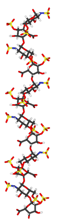
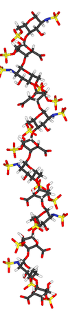
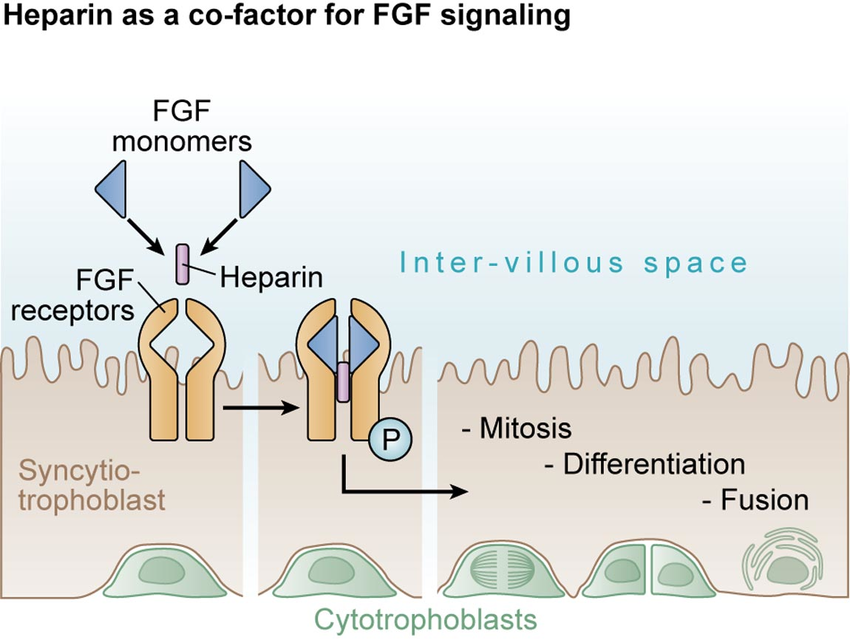

heparine adalah anggota keluarga glikosaminoglikan karbohidrat. terdiri dari unidisakarida berulang yang tersulfasi secara bervariasi. heparine memiliki isomer

isomer heparine yaitu konformasi 2s0

isomer heparine yaitu konformasi 1C4

kedua model tersebut mengadopsi konformasi heliks.

Heparin dapat memiliki variasi panjang unit berulang dan gugus sulfo yang terikat pada
posisi yang berbeda-beda

Heparine sebagai co-factor dalam pensinyalan FGF terhadapat FGFR