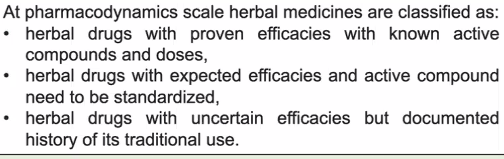
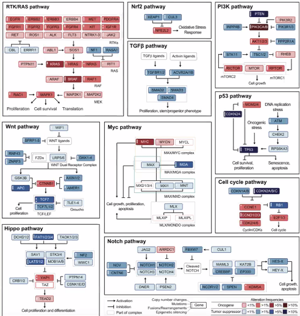
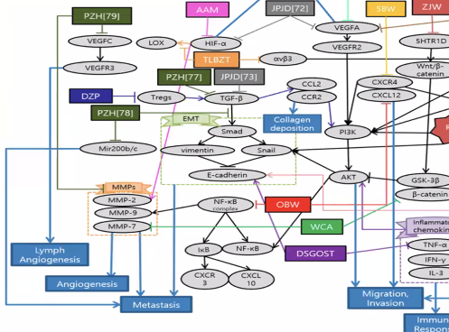
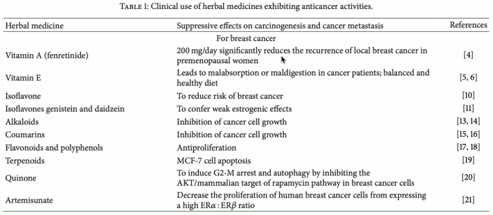
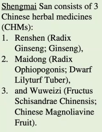
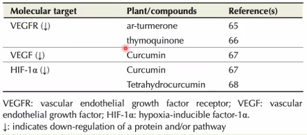

Sejarah di indonesia ilmu tentang obat dibuktikan dalam relief borobudur, fosil lumpang, manuskrip usada bali, primbon kartasuro dan serat cetini. 

western medicine dan eastern medicine. synthetic drug dapat dimodelkan seperti herbal medicine. tetapi baru-baru ini mereka cenderung kembali ke herbal medicine karena synthetic drug banyak memberikan efek samping. 

herbal medicine relative murah dan memiliki minimal efek sapming. 

## Kanker
bentuk sell yang tidak terature merupakan salah satu ciri munculnya kanker

prolirefasi kanker melibatkan banyak pathway, menghambat satu pathway belum tentu menghentikan poliferasi kanker. 

natural drug mungkin saja menargetkan sekaligus pathway karena kaya akan senyawa aktif. 

misalnya jamu PZH (79) dari china memberikan multiple interaction 

obat herbal china sudah regular diresepkan oleh dokter yang sudah distandarisasi. 

contoh obat herbal dari china

Perlu dilakukan uji klinis untuk medicine herbal sehingga dapat diketahui standarisasi darinya agar dapat dimanfaatkan kepada manusia. 

----------------------
KAGG
jika tertarik pada suatu protein
STRING DATABASE

tantangan herbal medicine -> sangat kompleks antar senyawa yang dikandung. semakin banyak yang bekerja semakina susah dijelaskan. sinergitas antar senyawa bisa menggunakan stich melihat antagonis atau protagonis, bisa dimasukkan ke stich bisa dilihat mana senyawa yang antagonis dan sinergis. yang dipertimbangkan adalah senyawa yang dominan. karena yang dominan itu akan lebih memberikan efek yang banyak daripada senyawa yang minoritas. 

mungkin saja herbal medicine juga bisa menyesuaikan dimana ia akan bekerja. (imunoregulasi). 

http://ijah.apps.cs.ipb.ac.id/#/home

