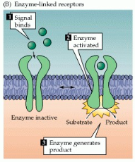

reseptor tirosin kinase adalah reseptor yang diklasifikasikan sebagai *enzyme-linked receptors*[*](https://www.ncbi.nlm.nih.gov/books/NBK10989/#_ncbi_dlg_citbx_NBK10989). reseptor tirosin kinase : Mereka bertindak sebagai transduser sinyal yang memediasi komunikasi sel-ke-sel dengan memfosforilasi residu tirosin pada protein substrat intraseluler utama

RTK adalah reseptor permukaan sel berafinitas tinggi untuk banyak polipeptida seperti *growth factor, cytokines, dan hormone*[*](https://en.wikipedia.org/wiki/Receptor_tyrosine_kinase#cite_note-robinson1-1)

reseptor tirosin kinase memiliki perang penting dalam perkembanga berbagai jenis kanker[*](https://en.wikipedia.org/wiki/Receptor_tyrosine_kinase#cite_note-Receptor_tyrosine_kinase_signalling_as_a_target_for_cancer_intervention_strategies-2)

ada 20 reseptor tirosin kinase yang telah teredintifikasi, beberapa diantaranya adalah

1.  RTK class II ( insulin receptor family)
2.  RTK class IV (VEGF receptor)
3.  RTK class V (FGF receptor family)

setiap monomer terdiri dari domain singgle hydrophobic transmemebrane-spanning yang terdiri dari 25 hingga 38 asam amino, wilayah terminal N ekstraseluler dan wilayah terminal C intraseluler[*](https://en.wikipedia.org/wiki/Receptor_tyrosine_kinase#cite_note-zzz-8). domain ini mengandung situs pengikat ligan yang mengikat ligan esktraseluler misalnya *growth factor atau hormon tertentu*

small molecule tyrosine kinase inhibitors disebut juga dengan TKIs

beberapa inhibitor reseptor tirosin kinase khususnya pada studi kanker adalah sebagai berikut
TKI non selektif:

1.  Lucitanib (E3810)
2.  Nintedanib (BIBF1120)
3.  Dovinitib (CHIR258 or TKI258)

TKI selektif:

1.  AZD4547
2.  BGJ398 (NVP-BGJ398)
3.  erdafinitib (JNJ42756493)