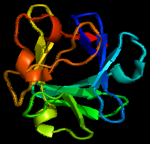

Biochemicals that inhibit FGF-2 have many applications in biochemical and physiological research. 

(*gambar bFGF*)

Selama penyembuhan luka pada jaringan normal dan perkembangan tumor, enzim heparat sulfat mengaktifkan bFGF

bFGF adalah salah satu dari keluarga FGF yang berikatan dengan heparin. 

FGF2 menginduksi angiogenesis [*](https://journals.plos.org/plosone/article?id=10.1371/journal.pone.0138801#pone.0138801.ref019) pelaporan studi mengatakan bahwa terjadi over ekspresi FGF-2 pada tumor ganas [*](https://journals.plos.org/plosone/article?id=10.1371/journal.pone.0138801#pone.0138801.ref023) 

