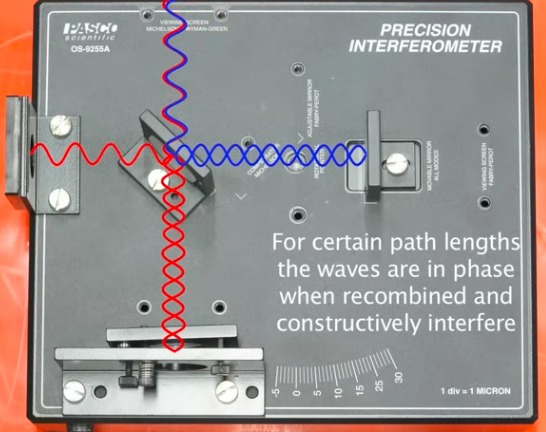
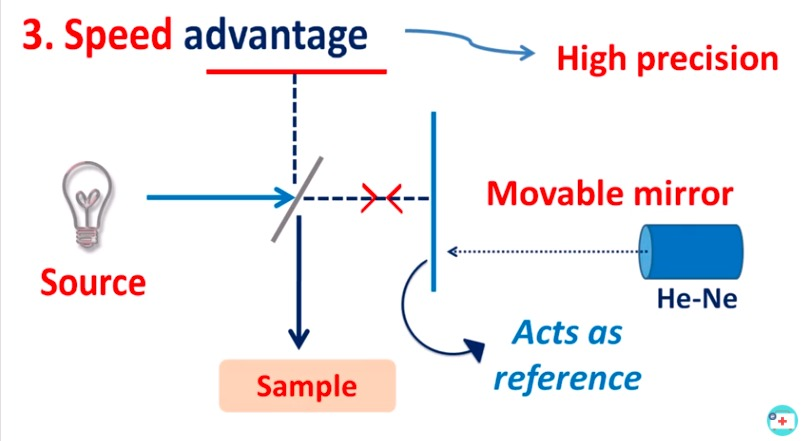
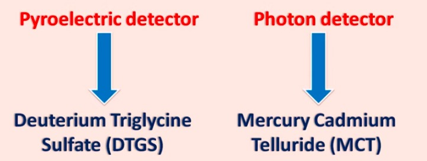
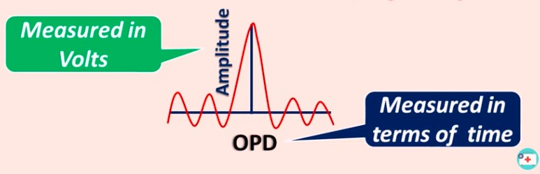
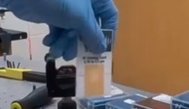
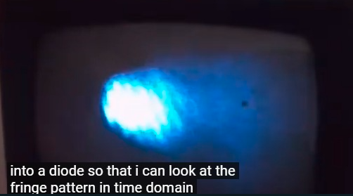

konsep dasar pada interferometer didasarkan interferensi gelombang. terbagi menjadi dua yaitu interferensi yang memperkuat dan memperlemah.

>Umumnya, FTIR spektrometer menggunakan interferometer Michelson.

He-Ne digunakan untuk mengukur jarak mirror. seberapa besar nilai delta movable mirror. 

> umber near-IR dapat menggunakan lampu tungsten, sumber far-IR dapat menggunakan lampu mercury

detektor keluaran interferogram ditangkap dengan sensor diatas

anda tahu ketika fotodioda diberikan sinar, maka dapat mengalirkan volts, dan semakin intens cahaya tersebut maka besar volts juga akan meningkat

FTIR dapat menggunakan sampel padat, dengan melapisinya dengan KBr. 

> sensor IR dapat menggunakan kamera CCD atau photosensitive card
> 
***

movable cermin digerakkan dengan piexoelektrik. 

low cost michelson interferometer[*](https://youtu.be/e66Kz-9ryWk)
setup interferometer[*](https://youtu.be/jPNu5EB7LcQ)
demo[*](https://youtu.be/lzBKlY4f1XA)