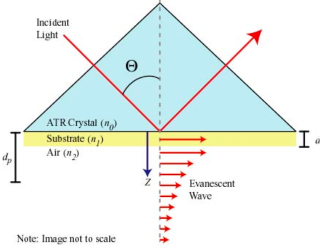
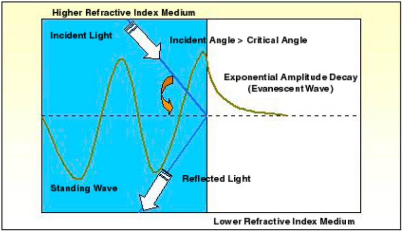

Dalam elektromagnetik, medan evanescent adalah energi yang terkonsentrasi spasial di sekitar sumber. 

evanescent wave hanya terjadi sangat pendek dari antarmuka material yang memiliki indeks bias berbeda.

Evanescent waves are generated when light passes through an optical fiber due to total internal reflection. The field decays exponentially with distance from the interface

Evanescent wave (gelombang evanescent) adalah fenomena di mana cahaya dapat menembus permukaan antarmuka antara dua media, tetapi hanya secara efektif meresapi ke dalam medium yang kurang padat (kurang refraktif) dari medium asalnya. 