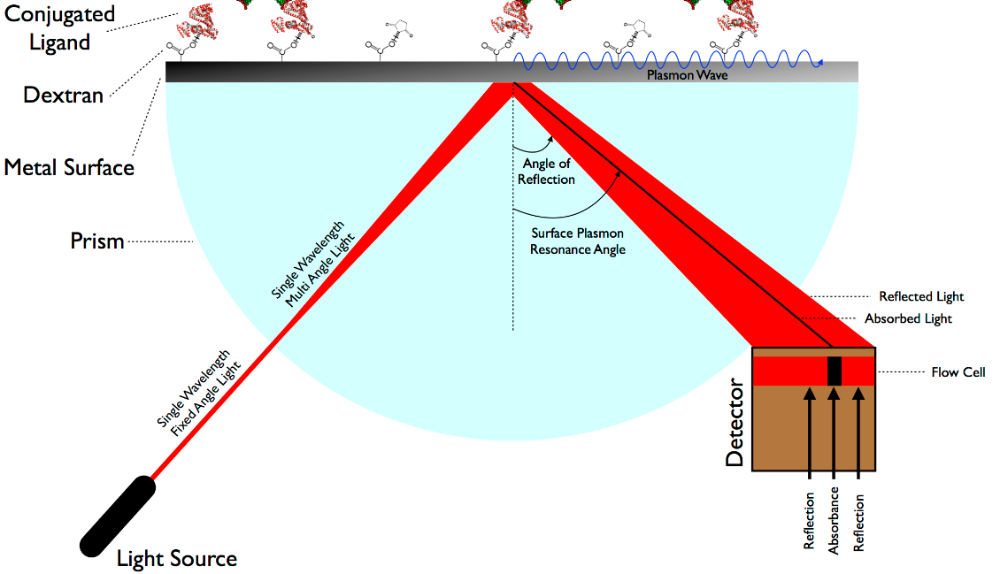

setiap perubahan seperti pertambahan massa akibat pengikatan akan menyebabkan perubahan indeks bias di sisi lain yang mempengaruhi osilasi elektron. 

sudut SPR adalah sudut yang diukur dari tegak lurus total refleksi internal cahaya ke minimum cahaya yang terjadi

perhatikan *Surface Plasmon Resonance Angle*