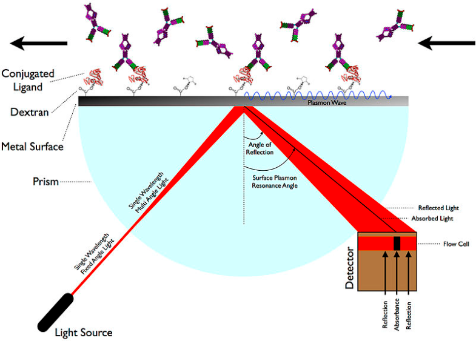

merupakan disiplin ilmu yang tergolong muda. plasmonic dinamakan pada tahun 2000. bidang ilmu yang mempelajari osilasi kolektif dalam metal karena sinar. 

plasmonic is the study of the interaction of light and free electrons in metal nanostructures

when light hit the metal, it excites the free electrons, creating a wave of oscillating electrons known as a plasmon. 

absorbance disebabkan adanya interferensi yang dihasilkan dari permukaan plasmon.  

Surface plasmon resonance (SPR) has found extensive applications in chemisensors and biosensors

Both the intensity and the position of SPR strongly depend on
the size, shape and composition of the nanostructures, as well
as the dielectric properties of the surrounding environment (Royal Society of Chemistry)

> salah satu author merupakan sarjana kimia dan alumni zhejiang
> 

https://youtu.be/RO6Rq6-cqsY