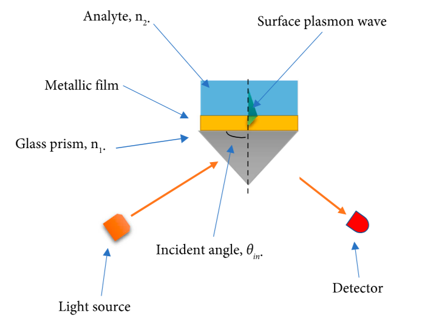
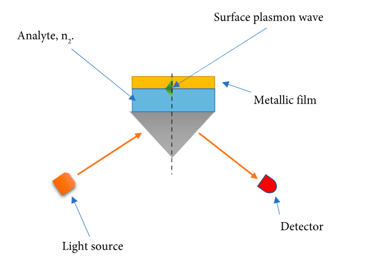

Perbedaannya adalah, untuk konfigurasi Krestchmann, analit yang diinginkan berada pada permukaan emas dan plasmon tereksitasi di bagian atas lapisan emas, sedangkan untuk konfigurasi Otto, analit yang diinginkan berada di antara lapisan emas

*Krestchmann*

*ottoman*