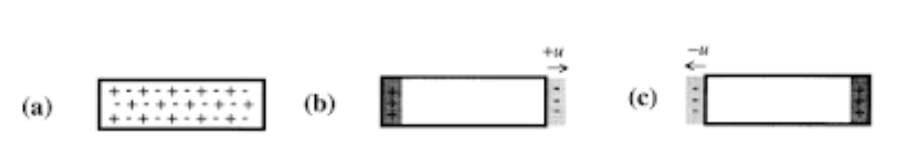

**Plasmon is colective oscilation of charged particles.**
anda tahu bahwa logam memiliki banyak elektron bebas. elektron tersebut bergerak bebas dalam metal. 

> plasma merupakan bentuk keeempat dari materi. plasma merupakan gas yang terionisasi, walaupun bermuatan, namun secara kseluruhan plasma bersifta netral karena tersusun atas ion positif dan elektron yang bermuatan negatif dengan jumlah yang sama

ternyata plasma juga terdapat pada logam. karena mengandung ion-ion positif dan elektron-elektron bebas. 

## OSILASI
pada kondisi keseimbangan, elektron bebas tersebar merata membentuk awan elektron. misalkan keseimbangan diganggu dengan menempatkan logam didalam medan listrik yang mengarah ke kiri. maka elektron bebas akan bergerak ke **kanan**. kemudian apabila medan listrik dihilangkan maka elektron bebas akan bergerak ke **kiri** karena adanya gaya pemulih. tetapi pergerakan tersebut akan melebihi kondisi keseimbangan yang menyebabkan elektron bebas bergerak lagi ke **kanan** (tentunya dengan energi lebih rendah) dan seterusnya. dengan kata lain elektron bebas akan bolak-balik melalui titik keseimbangan. osilasi ini disebut dengan osilasi plasma.

Jadi, plasmon didefinisikan sebagai osilasi kolektif dari elektron valensi logam. disebut kolektif karena ini merupakan pergerakan gabungan elektron-elekgron, bukan hanya disebabkan oleh pergerakan elektron tunggal. 

***

Plasmon menentukan sifat optik dari logam. Cahaya yang mempunyai frekuensi lebih rendah daripada frekuensi plasmon akan dipantulkan karena elektron pada logam akan menahan (screen) medan listrik dari cahaya. Sebaliknya cahaya yang mempunyai frekuensi di atas frekuensi plasma akan diteruskan karena elektron tidak cukup cepat untuk merespon medan listrik dari cahaya. Pada kebanyakan logam, frekuensi plasma berada pada daerah ultraviolet sehingga membuat logam berkilau (reflektif) terhadap sinar tampak. 