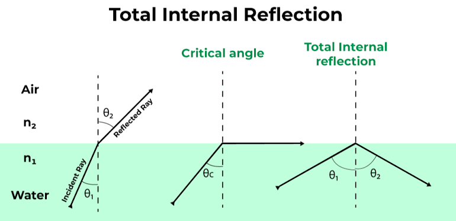
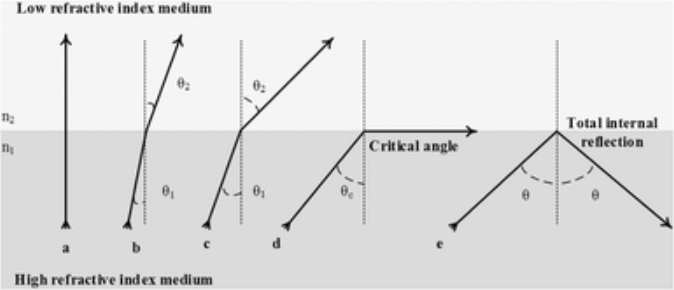

gelombang yang tiba di antarmuka dari satu media ke media lain tidak dibiaskan ke media kedua, tetapi sepenuhnya dipantulkan kembali ke media pertama

critical angle, ketika gelombang yang dipantulkan sejajar dengan permukaan pertemuan dua medium (air and water)

terjadi karena adanya perbedaan indeks bias

semakin besar massa molekul analit yang terdeteksi oleh permukaan logam, semakin signifikan perubahan indeks bias yang terjadi. Ini memberikan dasar untuk menggunakan SPR sebagai teknik yang sangat sensitif terhadap perubahan massa molekul pada permukaan sensor