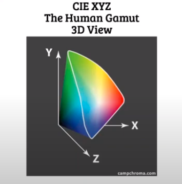
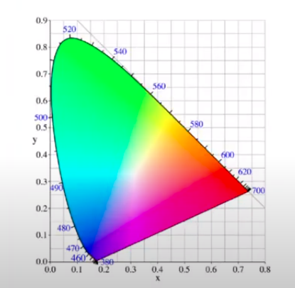

Color Space?
adalah model warna dimana warna direpresentasikan dengan nilai intensitas yang telah ditetapkan. Color space memiliki berbagai bentuk: 1D, 2D, dan 3D. 

3D Color space yang dibuat oleh commision of illumination. sumbu Y disitu merepresentasikan lumminance.

> Human Gamut, warna yang hanya bisa dilihat mata manusia. 

> Warna Imajiner, warna yang tidak dapat dilihat mata manusia, terletak pada luar cakupan plot. 

*2D Color Space*, merupakan turunan yang menghilangkan lumminance (sumbu Y). sehingga umum juga dinamakan diagram kromatisiti, tidak semua alat dapat menampilkan semua warna. salah satu contoh warna imajiner yaitu terletak pada koordinat (x=0.70, y=0.8).

jika warna imajiner tersebut eksis, maka yang hanya bisa dilihat adalah yang mendekati pada plot, yaitu hijau (x=0.20, y=0.8).

sama halnya jika anda mencoba mencari nilai diluar plot pada color space 3D, mata manusia tidak dapat mendektesi warna sebenarnya pada koordinat tersebu.  

> CIE XYZ adalah model warna CIE 3D

> CIE xyY adalah model warna CIE 2D

> CIE (Commission Internationale de l'Éclairage)