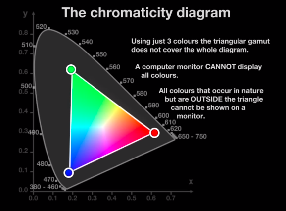

diluar plot segitiga diatas, monitor tidak dapat menampilkan warna secara akurat. warna diluar plot segita tersebut dapat dirasakan oleh mata manusia, tetapi tidak dapat dihasilkan oleh layar monitor. mata manusia terdiri dari 3 reseptor R, G, dan B begitu juga dengan bagaimana monitor memproduksi berbagai macam layar, tetapi memiliki keterbatasan. 