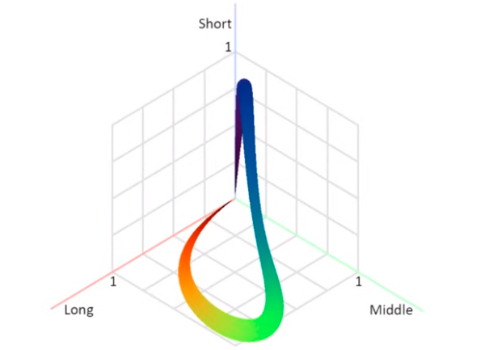
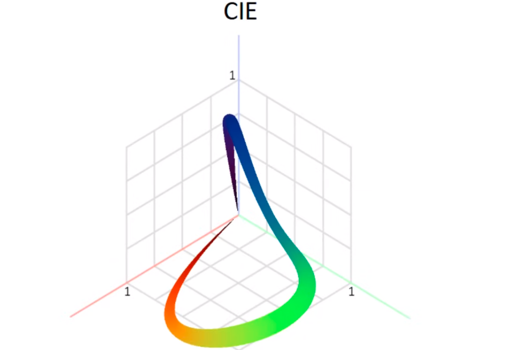
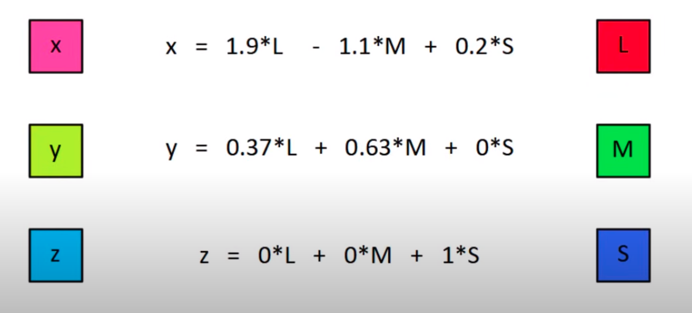
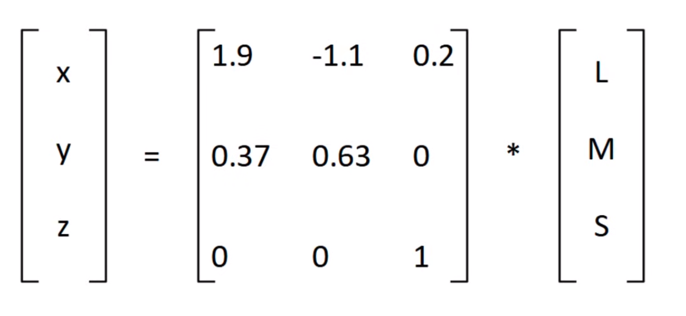
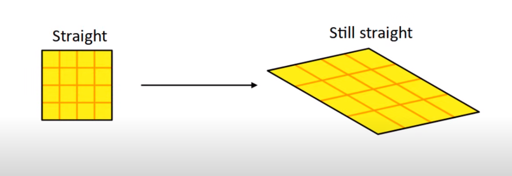
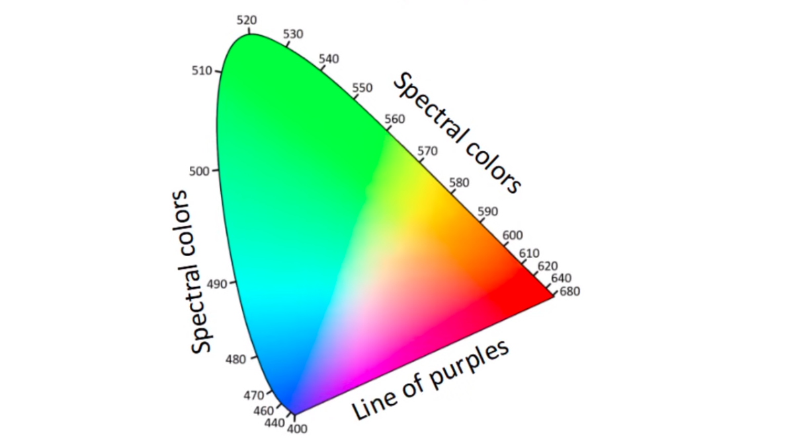
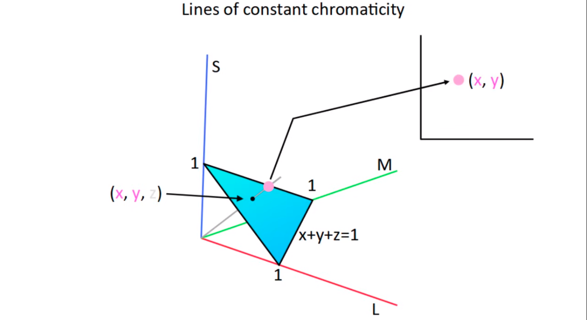
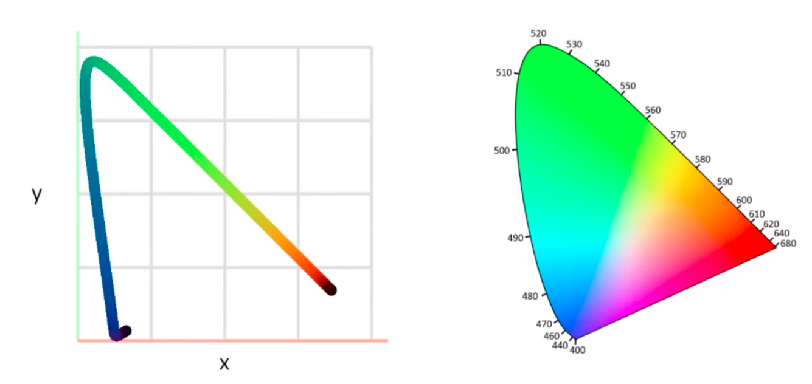
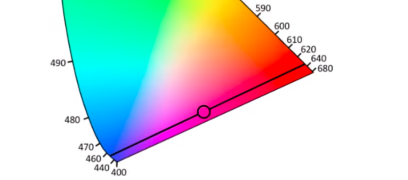
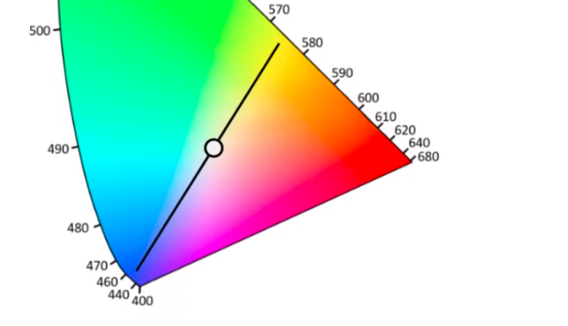

ruang warna 3D model LMS dapat dikonversi ke ruang warna 3D model CIE. 

*LMS*

*CIE (x,y,z model)* 

sistem untuk transformasi model LMS ke CIE

dari model ruang warna 3D CIE dapat ditransformasi ke model warna 2D CIE 1931

*CIE 1931 Diagram. sisi samping menunjukkan panjang gelombang*

transformasi 3D ke 2D dapat dilakukan dengan mencari sepanjang koordinat yang memenuhi persamaan x+y+z=1. kemudian diambil x dan y saja untuk membentuk diagram CIE 1931.

 	 

menggunakanya adalah dengan mengkombinasikanya adalah dengan mengkombinasikan dua panjang gelombang, misalnya untuk mencari purple dan putih

## Physics behind color
[*](https://youtu.be/gnUYoQ1pwes)
