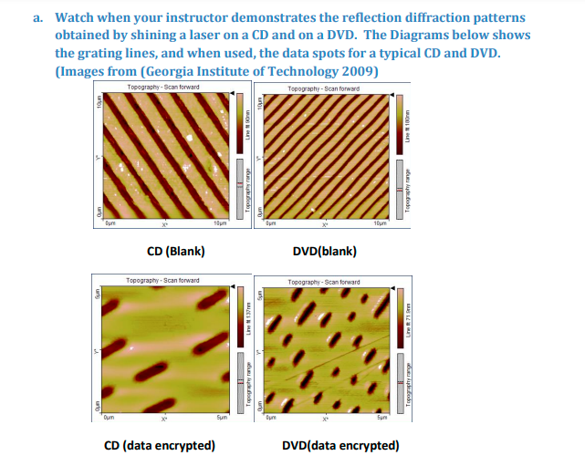
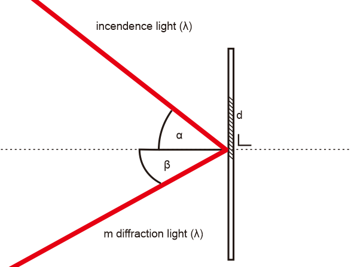
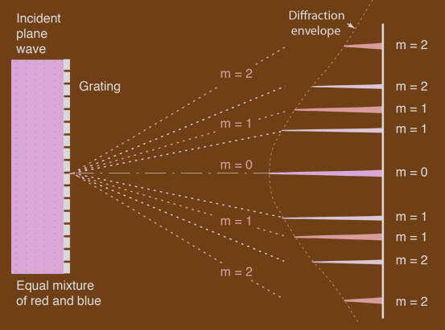
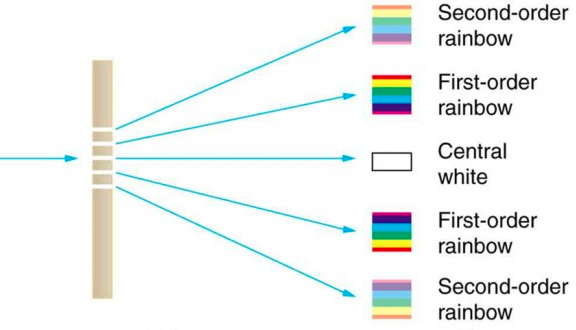

The most important characteristic of a diffraction grating is its number of lines per inch (or lines per mm). Sometimes  his is expressed as the "grating separation" which is the reciprocal of the lines per inch

persamaan matematis difraksi dapat direpresentasikan sebagai berikut

$$ m \cdot \lambda = d (sin(\alpha)) + (sin(\beta)) $$
- m adalah order gelombang
- λ adalah panjang gelombang (nm)
- d adalah grating separation (nm)

sudut difraksi sinar merah dapat ditentukan melalui persamaan rumus diatas, dengan mensubstitusi sudut incendence (alpha) terhadap *perpendicular difrraction*, panjang gelombang sinar, dan grating separation yang tergantun pada material. variabel m adalah representasi order dari panjang gelombang difraksi, seperti pada ilustrasi dibawah

