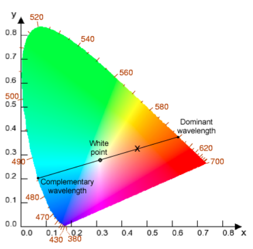
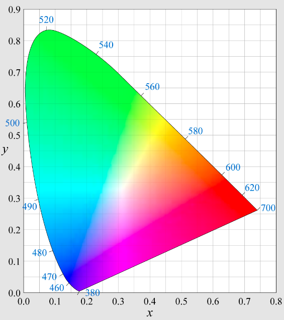
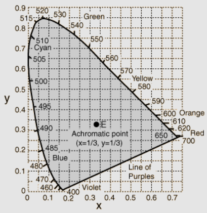

Koordinat Helmholtz adalah sistem koordinat kutub untuk menentukan bidang kromatisitas ruang warna 2D . Koordinat keliling adalah panjang gelombang dominan

> Merupakan turunan dari ruang warna 3D, disini satu koordinat yaitu Y, luminesense, diabaikan. 

seperti yang diketahui bahwa, warna-warna yang terjadi dialam tidak dapat secara tepat direpresentasikan dalam panjang gelombang, hal tersebut karena warna dialam merupakan campuran dari berbagai gelombang sinar tampak dengan komposisi yang berbeda-beda. Oleh sebab itu panjang gelombang dominant digunakan untuk menentukan panjang gelombang yang paling mendekati dengan warna yang akan diprediksi nilai panjang gelombangnya.

## Perhitungan penentuan panjang gelombang dominan
Untuk menghitung panjang gelombang dominan suatu warna, garis lurus ditarik pada diagram kromatisitas antara koordinat yang ingin diketahui dengan  titik putih (ada disekitar tengah). Garis tersebut kemudian diekstrapolasi sehingga memotong keliling diagram di dua titik, yang kelilingnya terdiri dari lokus spektral. **Titik perpotongan garis ekstrapolasi dengan lokus spektral menentukan panjang gelombang dominan**

> Ekstrapolasi berarti melanjutkan garis tersebut melewati batas diagram kromatisitas.

> The spectral locus (lokus spektral) is the curved edge of the CIE plot's

>  Titik putih didefinisikan sebagai [x,y]=(0.33,0.33) dalam ruang warna CIEXYZ

