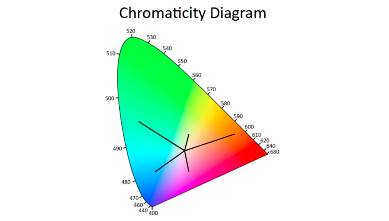
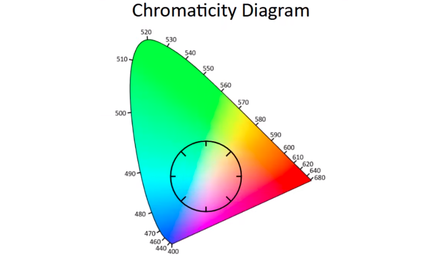
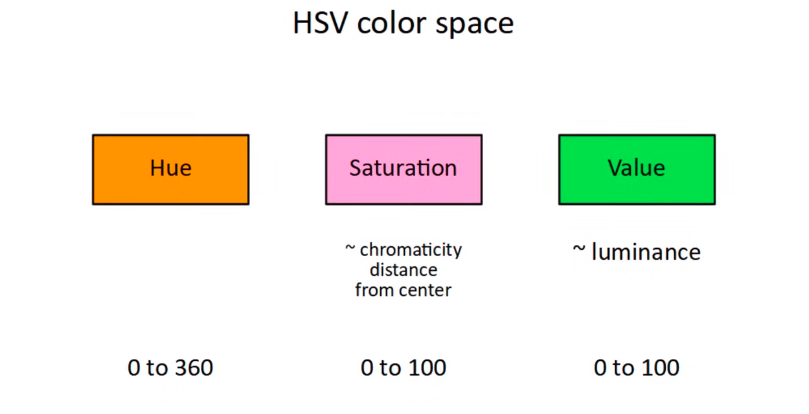
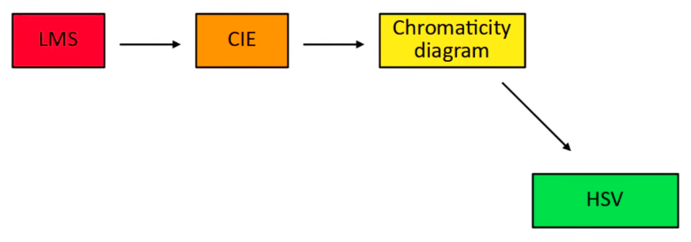
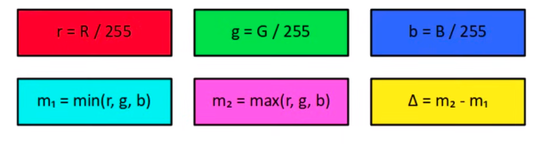

Hue Saturation Value (HSV). in CIE Color Space 2D. 
Value disebut juga dengan luminisence

Saturation disebut dengan kromatisiti, adalah jarak dari tengah grafik color space 2D, seperti diampilkan pada ilustrasi dibawah

sedangkan value merepresentasikan sudut kromatisiti

rentang dapat berkisar

HSV diperoleh dari diagram kromatisasi

komputer umumnya menggunakan RGB untuk merepresentasikan gambar dalam monitor. untuk mengkonversi RGB ke HSV dapat dilakukan sebagai berikut. membagi setiap parameter dengan 255, sehingga didapatkan skala 0 sampai 1. kemudian mencari nilai max dan min dari ketiga parameter, dan delta merupakan selisih dari keduanya

v (value) didefinisikan sebagai m2*100

ref[*](https://youtu.be/gnUYoQ1pwes)