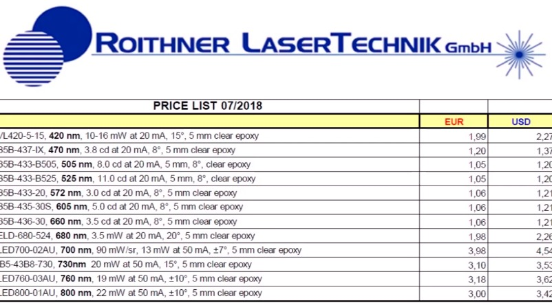
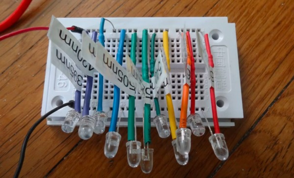
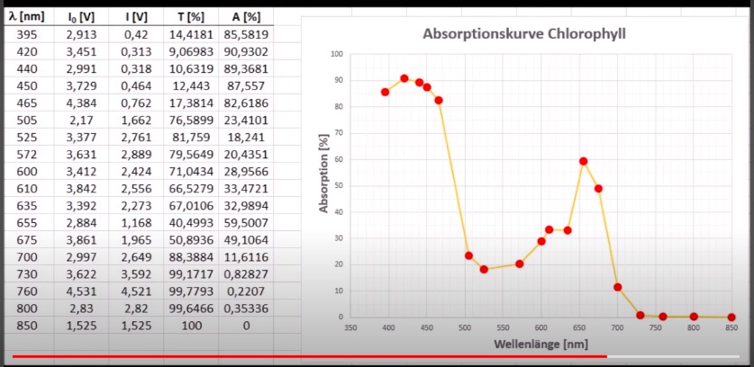
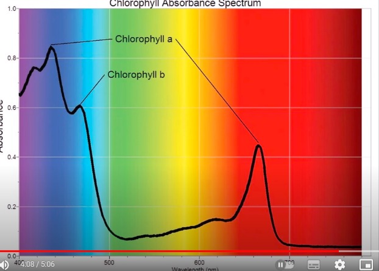
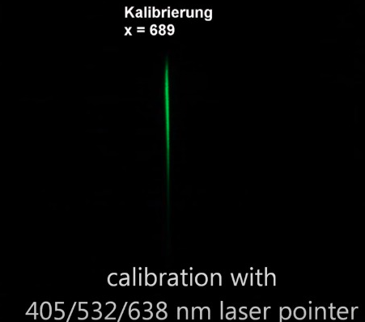
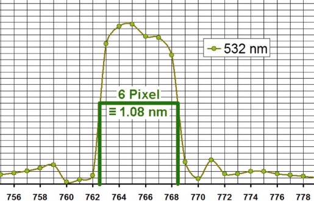
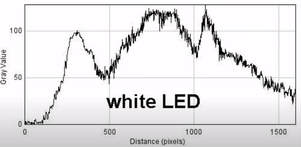
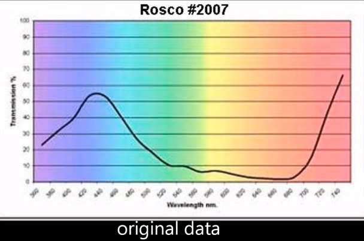
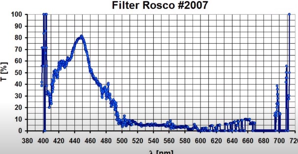
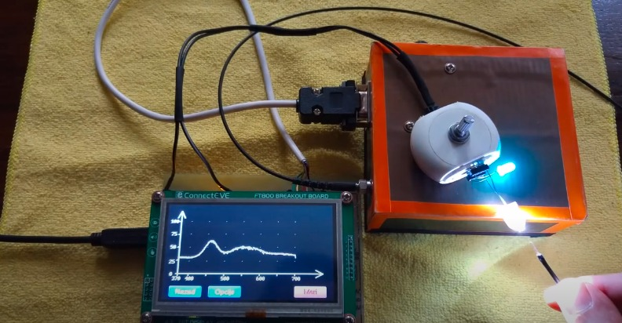

LED didesain untuk dapat mengemisikanpanjang gelomang elektromagnetik tertentu

*spektroskopi webcam*

*spectroskopi komersial*

kalibrasi spektroskopi
 

pada garis tersebut membentuk grafik dengan lebar 1.5 nm, jadi resolusi spektrometri tersebut 1.5 nm mengingat keterbatasan kemampuan webcam 

*spektroskopi komersial*

*spektroskopi webcam*

*penyesuaian prototipe dapat menggunakan kabel optik*

