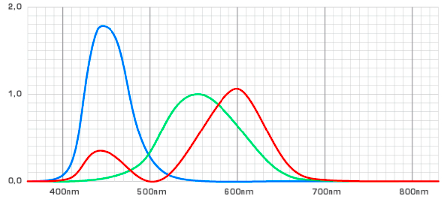
*tristimulus curves graph*
grafik sebagai fungsi untuk mencari warna pada visible spectrum melalui kombinasi red, green, blue. misalnya untuk mencari warna apa yang terdapat pada panjang gelombang 800nm, maka R bernilai 1, G bernilai 0.7 dan R bernilai 0 sebagai sumbu X, dan luminance sebagai sumbu Y. 

mengapa RGB?
ketiga elemen tersebut cukup mewakilli variasi warna yang dapat dideteksi indra manusia. red merepresentasikan warna pada spektrum tinggi, green pada spektrum sedang, dan blue pada spektrum tinggi. 

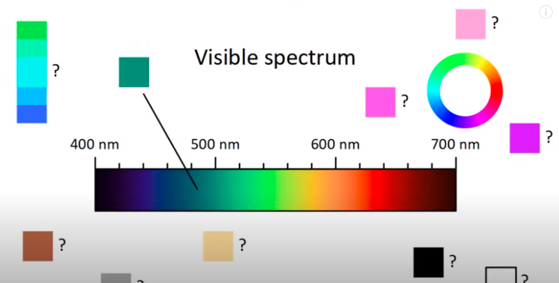
*visible spectrum*
dimana dapat menemukan hijau tua, hijau tua dapat ditemukan ketika luminance dikonsepkan. 

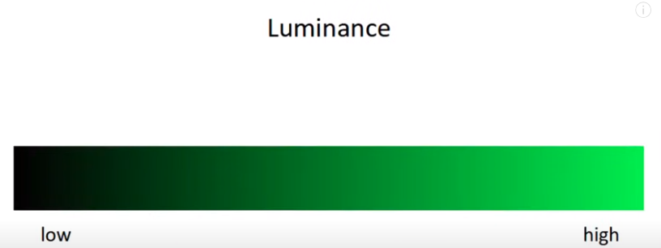
*luminance*
luminance rendah berarti hanya sedikit atom dalam material yang memendarkan spektrum tampak. hal tersebut membuat material tersebut lebih hitam. 

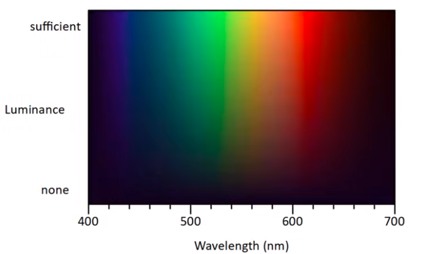
*visible spectrum with luminance*
konsep luminance akan memberikan variasi warna yang lebih banyak. misalnya seperti coklat. 

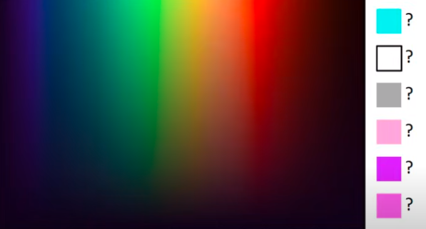
*tetapi masih belum dapat untuk menemukan warna tersebut*

memperkenalkan ruang warna 3D
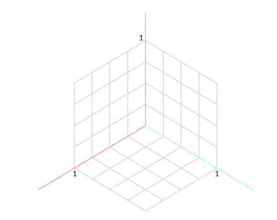
koordinat diwakiliki oleh RGB yang telah dinormalisasi, R sebagai long cones(L), G sebagai midle cones(M), dan B sebagai high short(S).

dengan ruang 3D warna, setiap warna dapat direpresentasikan sebagai matrix
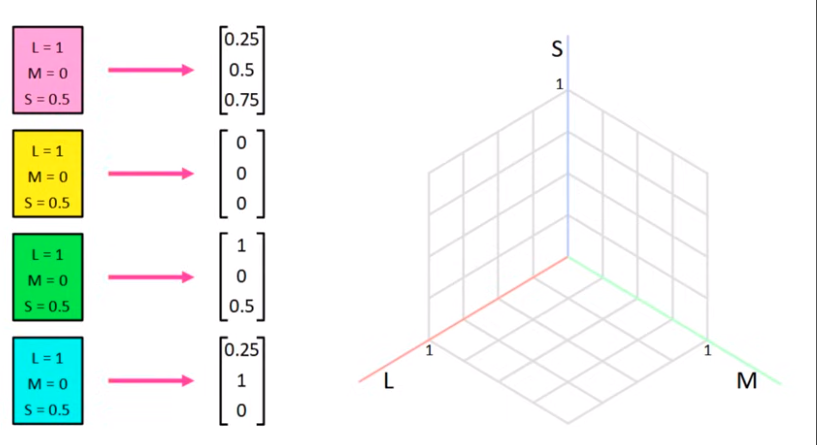

misalnya untuk 500nm yang telah dinormalisasi. *nilai LMS ditampilkan dalam ilustrasi*
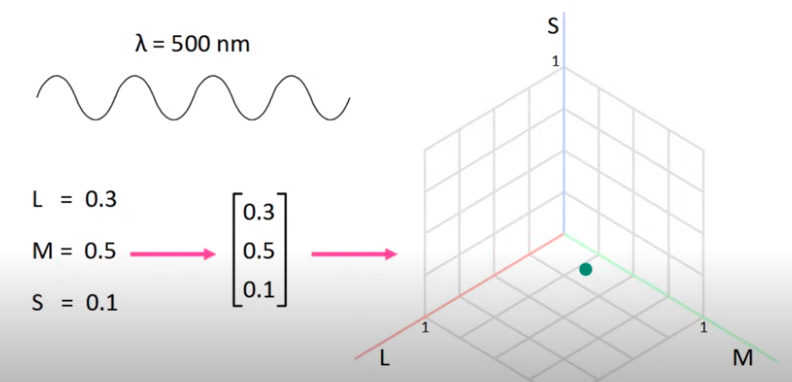
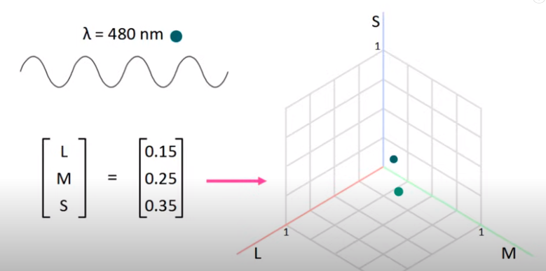
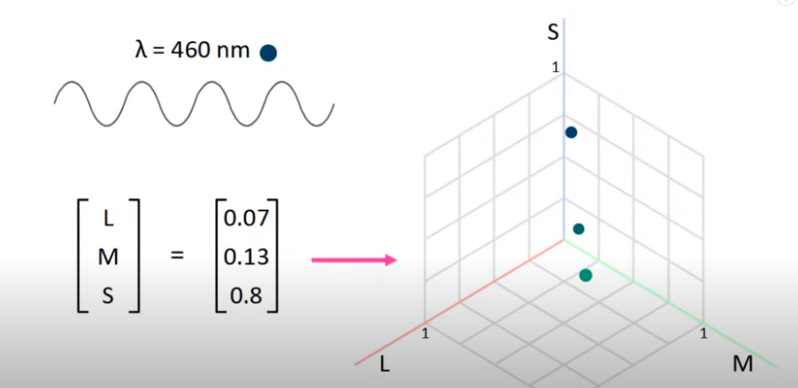
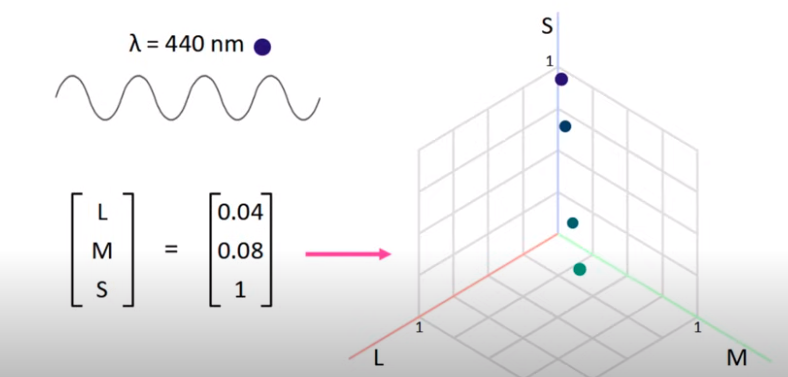

sistem untuk merubah panjang gelombang menjadi ruang warna 3D

dikenal dengan persamaan parametrik
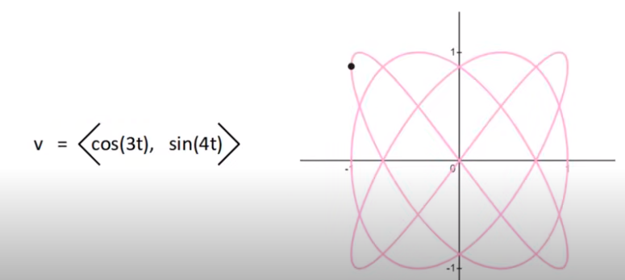
persamaan parametrik memungkinkan kita menggambarkan jalur atau bentuk dalam ruang warna tristimulus dengan menggunakan parameter-parameter tertentu.

L(t)=f1(t)
M(t)=f2(t)
S(t)=f3(t)

Di sini, t adalah parameter yang bisa diatur untuk mendapatkan berbagai nilai L, M, dan S. Fungsi-fungsi akan menentukan bagaimana nilai-nilai tristimulus berubah seiring perubahan parameter t, yang pada gilirannya akan mempengaruhi warna yang dihasilkan oleh kurva tersebut.

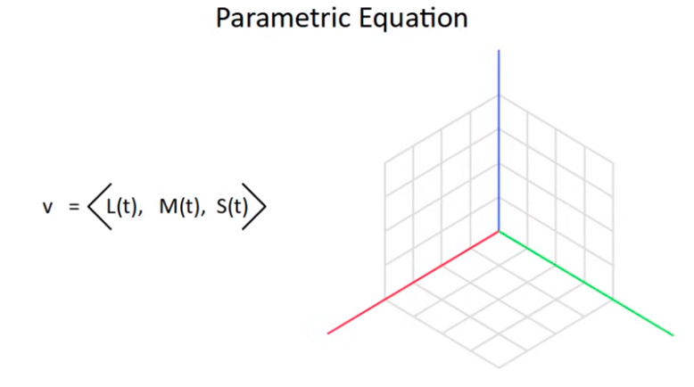

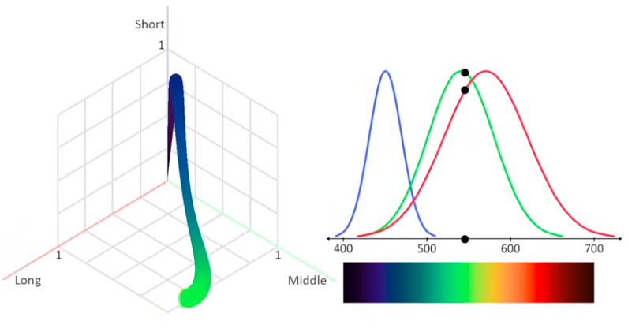
parameter dalam funsi semakin besar (panjang gelombang), menghasilkan kurva tiga dimensi seperti dibawah
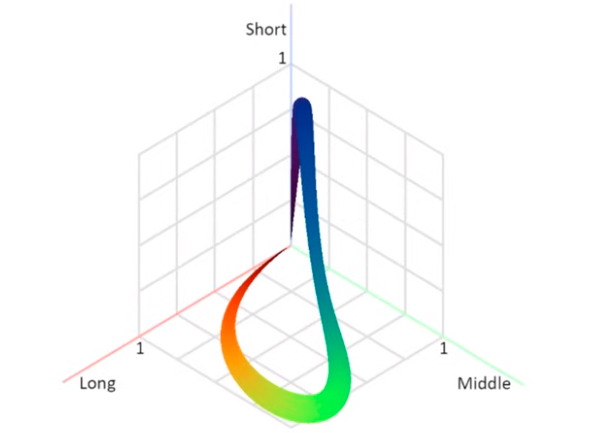
(plot konversi panjang gelombang ke ruang warna 3D).

ruang 3D menyisakan beberapa titik yang belum diketahui warna yang akan dihasilkan
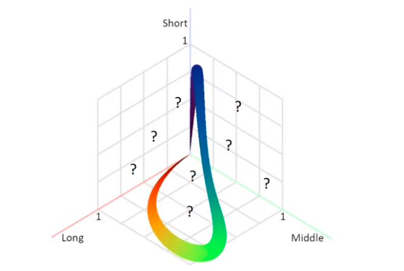

cyan dan warna sebagainya yang belum terepresentasi oleh tristimulus curves graph dapat diketahui lewat ruang warna 3D
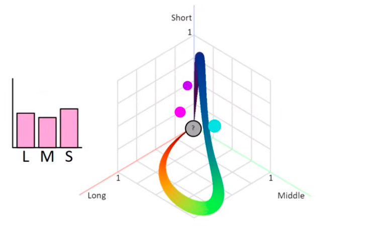

luminance pada ruang warna 3D akan mengarahkan pada nilai L, M, S yang semakin mendekati nilai 0. 
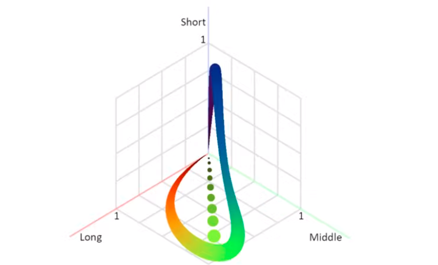

> lalu bagaimana ketika gelombang elektromagnetik dikonversi ke ruang warna 3D hanya menghasilkan sebagian warna saja?

well dalam keadaan nyata, cahaya yang dipancarkan merupakan gabungan dari cahaya yang disebut dengan cahaya polikromatik. 

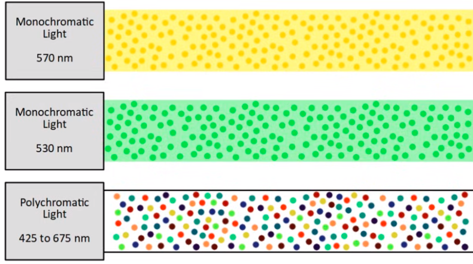