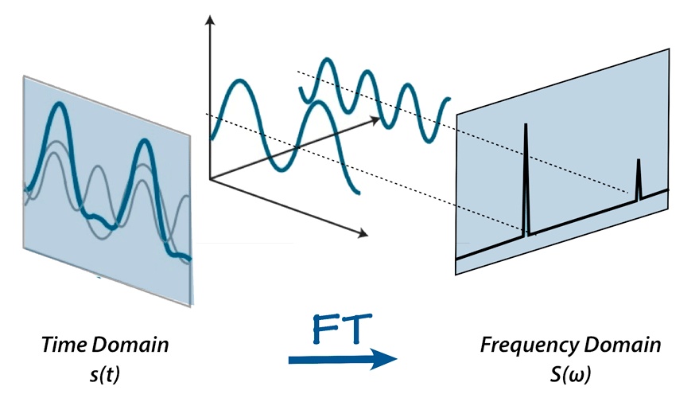
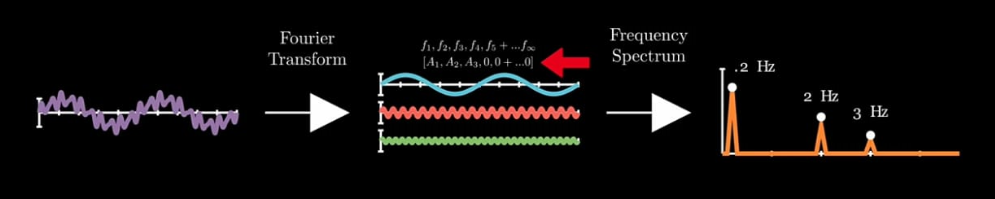

Fast Fourier Transformation (FFT) adalah instrumen matematika yang digunakan untuk spektroskopi Fourier Transform Ifrared (FTIR)

FFT for dummies [*](http://www.vlf.it/fft_beginners/fft_beginners.html)

bahwa ketika gelombang ditransformasi transform, gelombang tersebut sebenarnya terdiri dari beberapa frekuensi

intuitive expalining[*](https://youtu.be/v2LJ7Bk23kU?si=xKxiw7weZNKnbR_W)