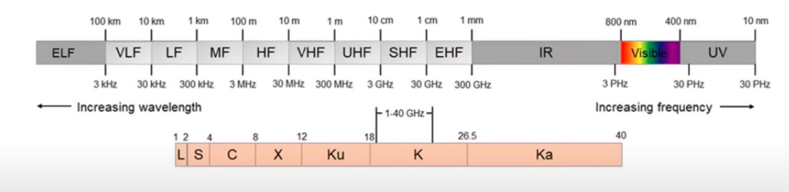

dibawah frekuensi Infrared, adalah frekuensi radio. frekuensi jenis ini dibagi menjadi beberapa rentang. mungkin anda familiar dengan frekuensi radio UHF atau SHF. ELF adalah frekuensi yang digunakan militer untuk berkomunikasi dengan kapal selam yang berada beberapa kilometer dibawah air

frekuensi tersebut sangat rendah sehingga memiliki kekuatan penetrasi yang baik. sebagai perbandingan, frekuensi yang digunakan telepon gemgam adalah 900 MHz - 1800 MHz sedangkan frekuensi ELF berada pada rentang 3 - 300 Hz

pada kapal selam, kelemahan menggunakan frekuensi tersebut adalah komunikasi hanya terjadi satu arah (pemancar ke kapal selam)

kelebihan yang dimiliki singal dapat ditransmisikan sampai ribuan kilometer, bergerak mengikuti lengkung bumi, hal tersebut karena singal dipantulkan oleh partikel bermuatan di lapisan ionosfer. Mekanisme tersebut dikenal sebagai Waveguide Mechanism
