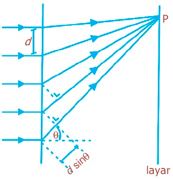
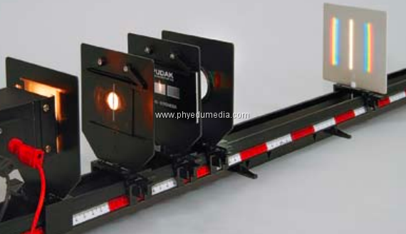
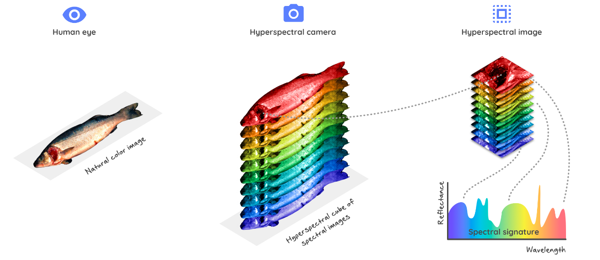
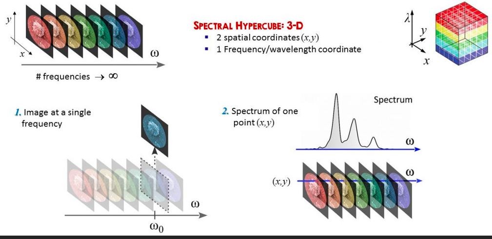
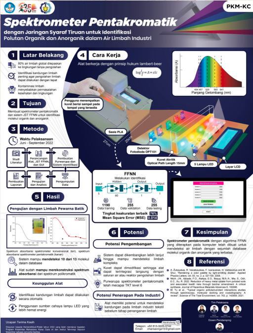
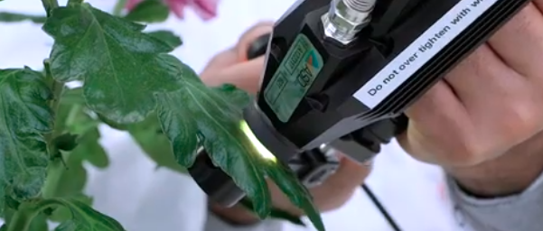

spektroskopi gelombang tampak paling sederhana adalah kisi difraksi

atau prisma. 

spektroskopi gelombang tampak lanjutan mungkin dikenal dengan hyperspectral imaging. 

*buku produk dan inovasi PKM*

atau produk yang telah dikomersialkan sebagai berikut [*](https://www.youtube.com/watch?v=ezpC7mtzSNw)

> ide saya adalah merancang spektroskopi yang memanfaatkan gelombang sinar tampak dan getaran untuk mengatasi keterbatasan sinar tampak 