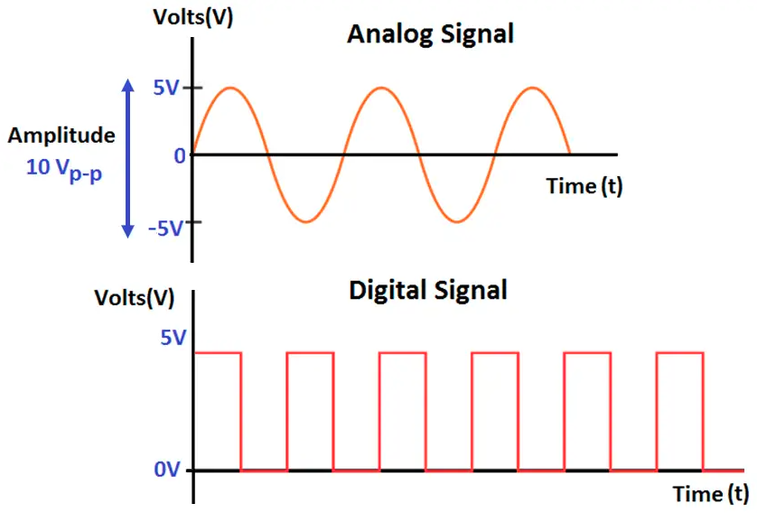
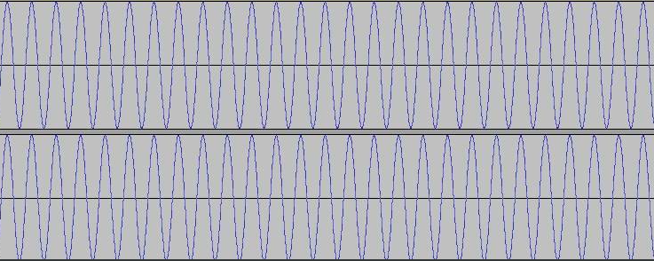
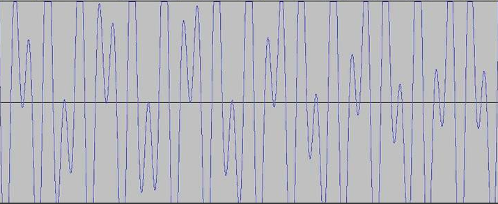

very low frequency (VLF) adalah gelombang elektromagnetik yang terletak pada kisaran gelombang radio. antara 3 kHz sampai 30 kHz. 

gelombang tersebut dapat dideteksi menggunakan sound card PC. bahwa sound card memiliki sirkuit penerimaan yang sensitif terhadap perubahan tekanan udara, fluktuasi tekanan udara akan diterima sebagai singal analog. singal elektromagnetik pada dasarnya adalah gelombang analog. 

gelombang elektromagnetik dapat mempengaruhi perangkat elektronik. mereka dapat menciptakan fluktuasi dalam tegangan listrik yang mengalir melalui sirkuit. hal tersebut membuat sound card mendektesi sebagai singal analog seperti halnya fluktuasi tekanan udara. [*](https://www.youtube.com/watch?v=fKSOoZ2vhvo)

*dapatkah dua gelombang VLF dikirim dan diterima sebagai singal yang masih utuh?*

ketika anda mengirimkan dua gelombang direpresentasikan atas dan bawah, 

ketika mereka ditransimiskan akan membentuk gelombang superimposed (bertumpuk)

**This doesn't mean the carriers are lost and you could still recover each one with suitable filters** mungkin filternya adalah sebuah kumpulan fungsi matematika

> jika sound card dapat berfungsi sebagai receiver VLF, dapatkah sound card berungsi sebagai transmitter VLF?

open lab website of vlf development: http://www.vlf.it/ 