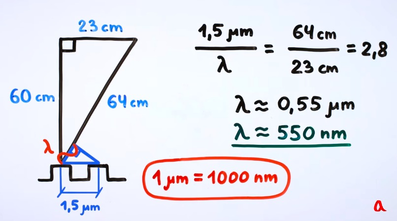
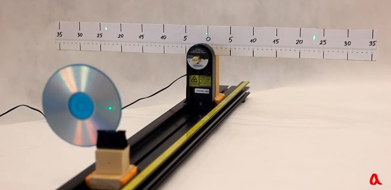
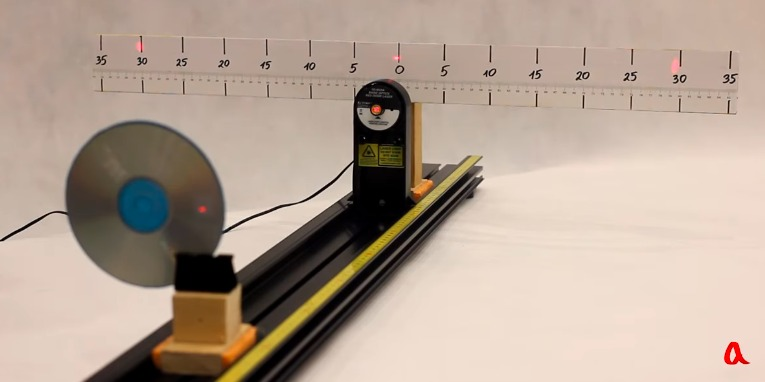
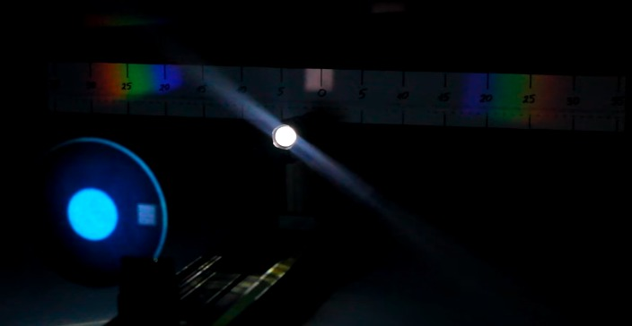
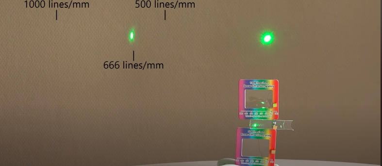

perhitungan panjang gelombang dengan memanfaatkan kisi difraksi CD. 

*panjang gelombang berbeda mempunyai jarak yang berbeda*

kisi difraksi dengan ukuran berbeda juga akan memberikan perbedaan jarak antar titik

