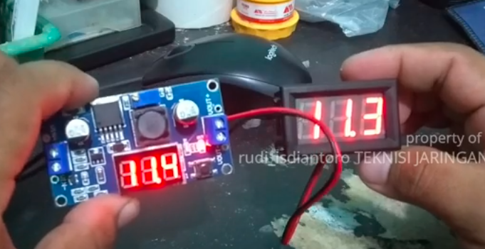
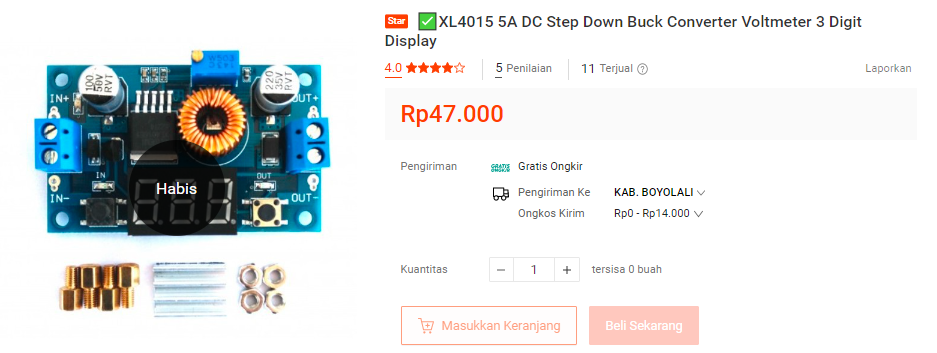
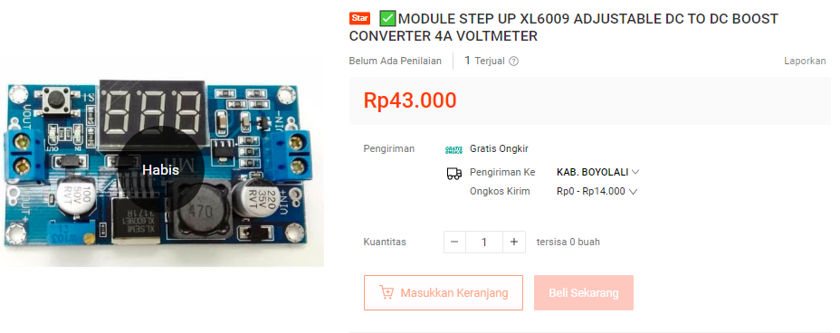

penurun tegangan DC, anda dapat mengecek input dari charge handphone, dan beban berupa multimeter juga bisa. apabila terlalu tinggi anda menurunkan tegangan, maka steper akan panas karena berat kerjanya. jika anda ingin menaikkan tegangan, gunakan step up. 

pengen ini

step down work in range 1.25-32V from input 5-36V

step down work in range 5V-38,4V from input 4.3V-32V