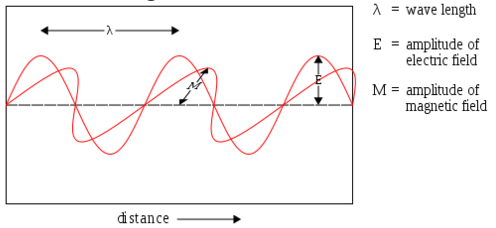
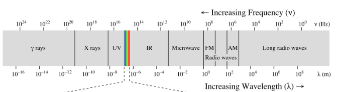
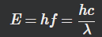
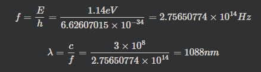

jika dalam radiasi tampak, amplitudo merepresentasikan kecerahan cahaya. dinyatakan dalam satuan SI sebagai Hertz

	c = λν
	
where λ is the wavelength (in meters, m) and ν is frequency (in Hertz, Hz). dan C adalah kecepatan cahaya. ini menunjukkan bahwa hasil kali adalah sebuah konstan kecepatan cahaya. sedangkan periode (T) rumusnya adalah 1/ frequency.

inframerah adalah gelombang elektronik yang dikeluarkan oleh benda panas, suhu yang tinggi cukup untuk mengangkat elektron ke tingkat yang lebih tinggi dan membuatnya bergoyang.

planck mengamati bahwa materi benar-benar menyerap atau memancarkan energi hanya dalam kelipatan bilangan bulat dari nilai hv, dimana h adalah konstanta plack 6.626x10 -34 J dan v adalah frekuensi cahaya yang terabsorbsi atau terpancar

energi tidak bersifat kontinu dan dapat ditransfer dalam jumlah berapapun, melainkan energi bersifat terdiskret (paket) yang kemudian disebut dengan quantum. contoh yang mudah dipahami adalah dalam sistem keuangan, anda tidak akan melihat sebuah makanan yang dijual dengan harga 2.346 rupiah, karena akan sulit untuk mentransfer nominal sebesar itu, lebih mudah dengan 2.000 karena memang sudah ditetetapkan, "unit terkecil yang mungkin ditransfer". 
****

hotons carry discrete amounts of energy called quanta. persamaan diatas dapat juga ditulis sebagai berikut

dengan v = f (frekuensi), dan lamda adalah gelombang

contoh lain: 
At room temperature, the voltage across an LED was measured to be 1.67 V. What is the band gap of this semiconductor, and what wavelength of light is emitted? 

The band gap is 1.67 eV, which corresponds to a wavelength of 743 nm. So the red light emitted!

##### contoh konkret :
energi minimum untuk mengaktifasi semikonduktor silicon diketahui adalah 1.14eV, berapa panjang gelombang elektromagnetik yang diperlukan untuk mengaktifasi?

dilihat di spektrum dibawah, bahwa panjang gelombang 1088 adalah dimulai dari radiasi infrared

Menurut hukum elektrodinamika klasik, suatu muatan listrik yang mengalami percepatan akan memancarkan energi dalam bentuk gelombang elektromagnetik. suatu muatan listrik yang mengalami percepatan elektron akan memancarakan energi sebanging dengan percepatan eneri kuadrat (Setiawan, Duyeh. Raduikimia Teori Dasar dan Aplikasinya. 58:2009).

