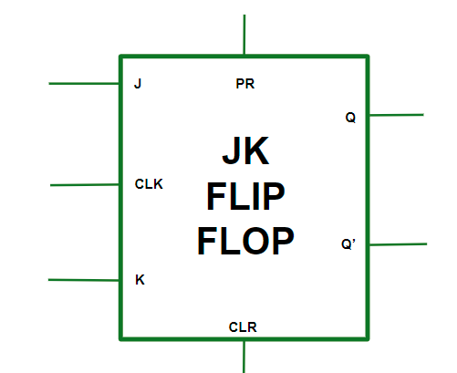
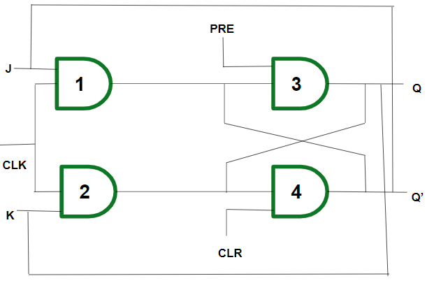
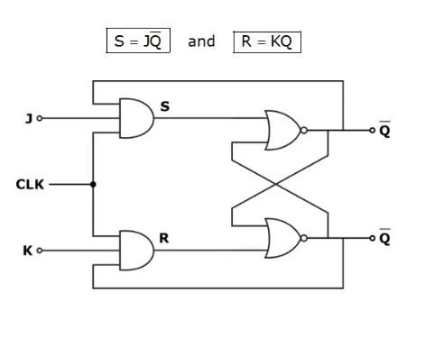

# JK flip flop
gerbang logika biasanya dibungkus sedemikian rupa dalam sebuah chip, misalnya untuk JK-flip flop

sebenarnya dalam kotrak tersebut ada logika gerbang yang saling terhubung

*Clock (CLK), Clear (CLR), and Preset (PR).*
atau sebenarnya seperti berikut
