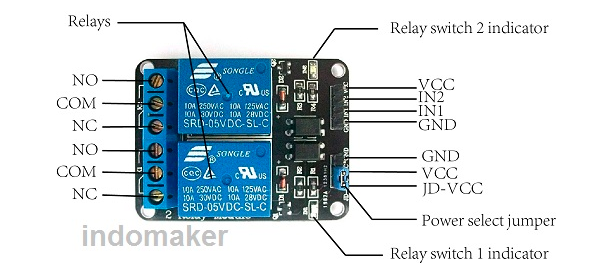
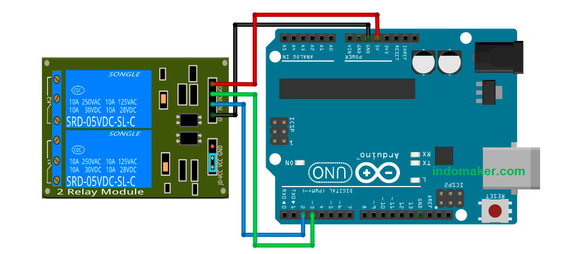
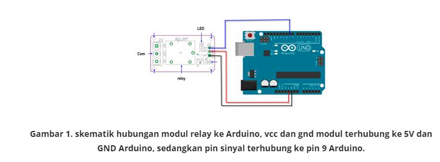
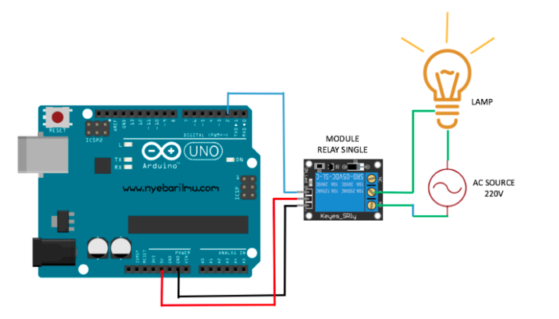

Relay adalah output yang dapat digunakan sebagai switch atau saklar untuk perangkat lain. Relay dikontrol dengan tegangan dari pin Arduino sehingga dapat melakukan switch. Terdapat 3 koneksi utama yaitu COM untuk input dari perangkat lain. NC(Normaly Close) pada keadaan biasa com akan terhubung ke pin NC. NO(Normaly Open) pada keadaan biasa tidak terhubung, namun saat relay mendapat tegangan dari Arduino maka COM akan berpindah dari NC dan terhubung dengan NO.


COM adalah keluaran, sedangkan NO dan NC adalah masukan, bedanya hanya kebalikan logika saja.

dapat digunakan untuk arus AC maupun DC. skema umum rangkaian relay-arduino


``` /*
 * Indomaker.com
 * relay 2 channel
 */
const int relay1 = 2; //pin2
const int relay2 = 3; //pin3
int relayON = LOW; //relay nyala
int relayOFF = HIGH; //relay mati
void setup() {
  pinMode(relay1, OUTPUT);
  pinMode(relay2, OUTPUT);
  digitalWrite(relay1, relayOFF);
  digitalWrite(relay2, relayOFF);
}
void loop() {
  //relay1
  digitalWrite(relay1, relayON);
  delay(1000);
  digitalWrite(relay1, relayOFF);
  delay(1000);
  //relay2
  digitalWrite(relay2, relayON);
  delay(1000);
  digitalWrite(relay2, relayOFF);
  delay(1000);
  //relay1 dan 2 nyala
  digitalWrite(relay1, relayON);
  digitalWrite(relay2, relayON);
  delay(1000);
  //relay1 dan 2 mati
  digitalWrite(relay1, relayOFF);
  digitalWrite(relay2, relayOFF);
  delay(1000);
}
```


*relay 2 channel*

skema rangkaian listrik 
