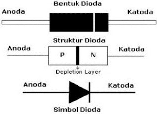
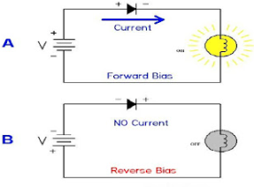
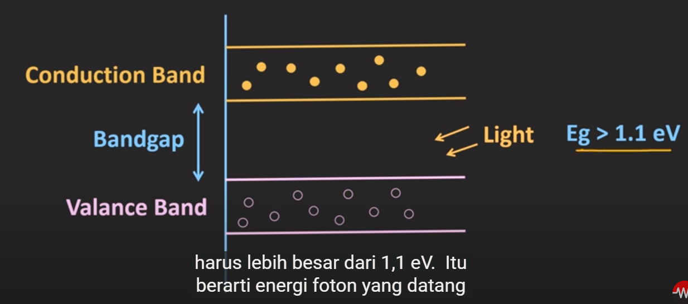

## Dioda

terdiri dari semikonduktor tipe-p dan tipe-n. sisi P disebut anoda dan sisi N disebut katoda. 

secara ideal, dioda dianggap sebagai sebuah saklar tertutup (isolator) jika diberi bias forward dan sebagai saklar terbuka(konduktor) jika diberi bias reverse. 

## Light Emiting Diode
Dioda pemancar cahaya ( LED ) adalah perangkat semikonduktor yang memancarkan cahaya ketika arus mengalir melaluinya. Elektron dalam semikonduktor bergabung kembali dengan lubang elektron , melepaskan energi dalam bentuk foton . Warna cahaya (sesuai dengan energi foton) ditentukan oleh energi yang dibutuhkan elektron untuk melintasi celah pita semikonduktor

## Photodiode
adalah dioda yang apabila terkena energy, maka dapat menghantarkan arus litrik (semikonduktor aktif menjadi konduktor) dengan range energi tertentu

