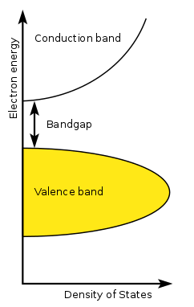
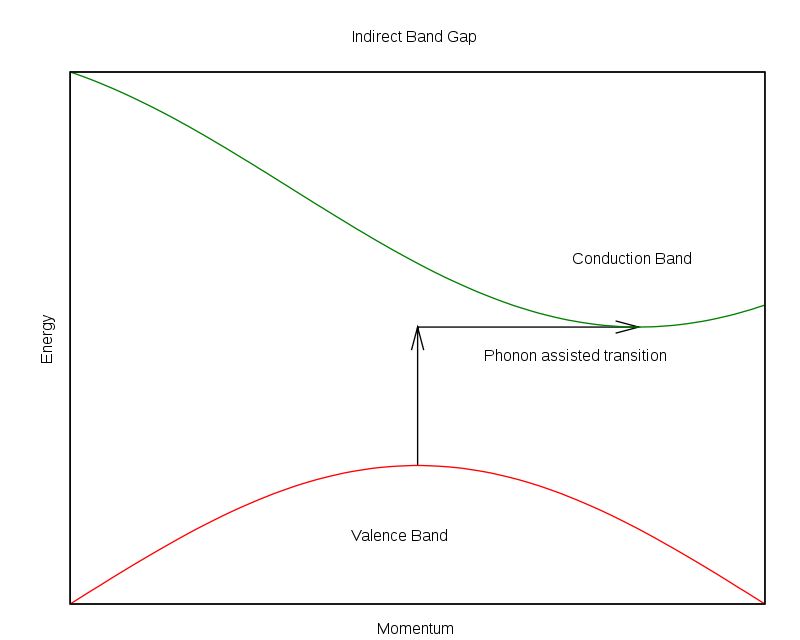
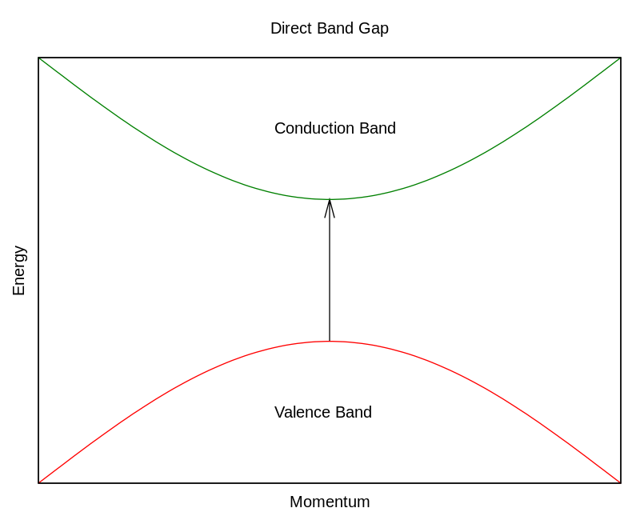

 Elektron dapat tereksitasi dari pita valensi ke pita konduksi oleh foton yang memiliki energi h ν lebih besar daricelah energi Eg antara pita. Prosesnya dinamai efek fotolistrik internal.
 
 Nilai E g bervariasi dari semikonduktor ke semikonduktor lain. misalnya timbal sulfida memiliki aktivasi semikonduktor di range gelombang elektromagnetik inframerah. sedangkan seng oksida berada di range gelombang elektromagentik ultraviolet. 
 
 
Energi celah pita semikonduktor cenderung menurun dengan meningkatnya suhu. Ketika suhu meningkat, amplitudo getaran atom meningkat, menyebabkan jarak antar atom yang lebih besar. Hubungan antara energi celah pita dan suhu dapat dijelaskan oleh ekspresi empiris Varshni : 

 E g (0), α dan β adalah konstanta material.
 
 #### table semikonduktor dan band gap energinya [*](https://en.wikipedia.org/wiki/List_of_semiconductor_materials)
perbedaan celah pita langsung dan tidak langsung. Dalam semikonduktor celah pita langsung, elektron yang "naik" dari pita valensi ke pita konduksi hanya akan mengubah potensinya (energi).
Dalam semikonduktor celah pita tidak langsung, elektron yang "naik" dari pita valensi ke pita konduksi akan mengubah potensi (energi) dan momentumnya.

Oleh karena itu, material celah pita langsung cenderung memiliki sifat emisi dan penyerapan cahaya yang lebih kuat dan cenderung lebih cocok untuk LED