Listrik statis (diam)
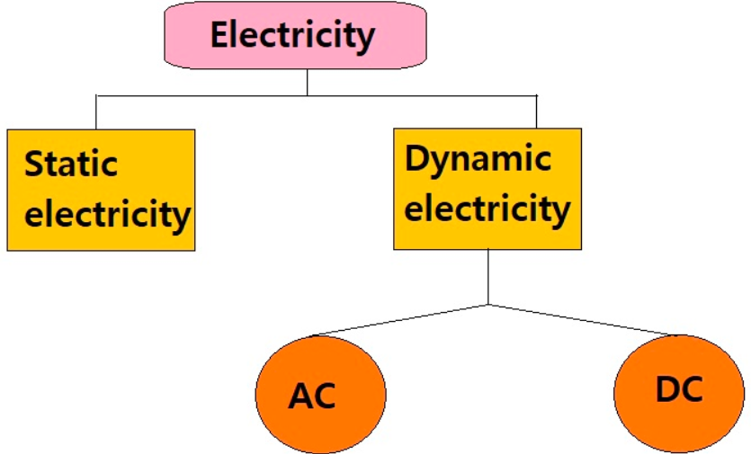
listrik yang terkumpul pada permukaan baik insulator maupun konduktor. 

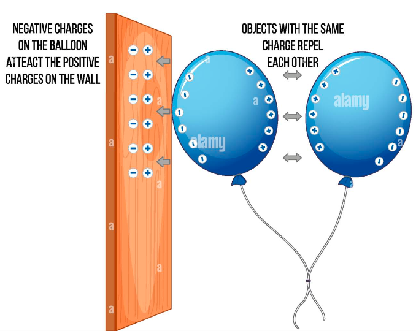

gesekan atau friksi merupakan sebuah energi yang cukup untuk mengeluarkan elektron yang berikatan lemah untuk menempel pada atom lain (beda permukaan). Hal tersebut membuat permukaan yang ditinggali elektron tersebut bermuatan positif karena kekurangan elektron, sementara atom pada permukaan lain yang dimasukin elektron lain akan bermuatan negatif. hal ini disebut dengan **ketidakseimbangan elektron** 

Jadi ketika sudah tidak ada gesekan atau friksi (energi) alam akan mencoba menyeimbangkan muatan muatan diatara keduanya. 
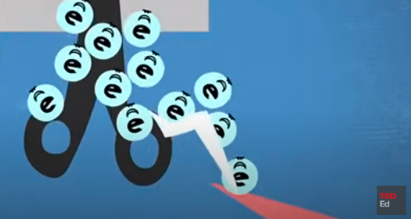

material yang memiliki elektron berikatan lemah adalah logam dan air garam. sehingga mereka akan mudah elektronya berpindah ke atom permukaan lain. sebaliknya insulator seperti plastik, karet atau kaca memiliki elektron yang berikatan kuat sehingga tidak mudah untuk dilepaskan. 

besarnya gaya interaksi direpresentasikan pada persamaan dibawah 
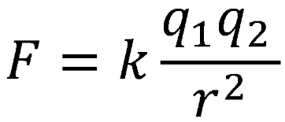

dengan F adalah gaya coulomb (N), k adalah konstanta coulomb (9×109N⋅m2/C), q adalah besar muatan benda (C), dan r adalah jarak antar benda. Maka bahwa semakin jauh jarak antara kedua muatan akan menyebabkan gaya listrik semakin kecil.

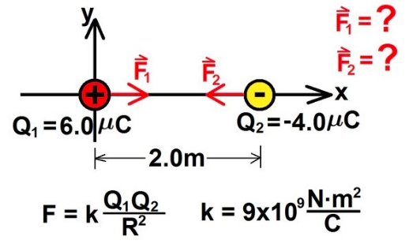

elektroskop adalah alat yang digunakan untuk mengamati besanya gaya coulomb yang ditimbulkan
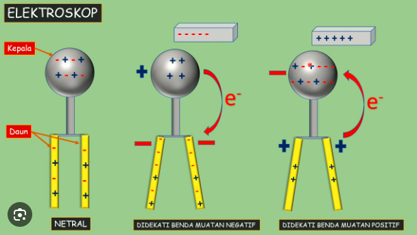

## Ballon digesekkan
ketika ballon digesekkan ke rambut, maka elektron berpindah dari rambut ke balon. namun ketika anda menggosokkan besi ke rambut apakah berlaku juga demikian, mari kita bahas faktor yang mempengaruhi hal tersebut. 

### Afinitas elektron
timbulnya listrik statis bergantung pada perbedaan afinitas elektron antara bahan (molekul) yang berinteraksi.

afinitas adalah energi yang dilepaskan ketika elektron ditambahkan ke atom netral *untuk membentuk anion dalam keadaan gas*.

semakin besar afinitas maka semakin lemah kemampuan menarik elektron, semakin kecil afinitas maka semakin kuat kemampuan menarik elektron. 

### Elektronegatifitas
ketika molekul memiliki elektronegativitas tinggi, maka molekul tersebut cenderung untuk menarik elektron. 

Namun, besi bukanlah salah satu unsur dengan elektronegativitas yang tinggi,

## Three Factors Affecting Electrostatic Force
berdasarkan rumus gaya coulomb, tiga faktor yang dimaksud adalah **muatan**, **jarak** antar objek, dan bahan **insulator** antar benda. dalam banyak kaus insulator yang dimaksud adalah udara. 

## What it's q
adalah muatan listrik (q) suatu molekul, misalnya atom Na memiliki elektron sebanyak 11. tiap elektron akan memiliki muatan negatif sekitar `-1,6 x 10^-19` coulomb (C).  maka besaran q atom Na adalah `11`  $\cdot$ `-1,6 x 10^-19` adalah sekitar `−1,6×10 −18 C`

petir akan mengambil jalur ruang yang lebih mudah terionisasi
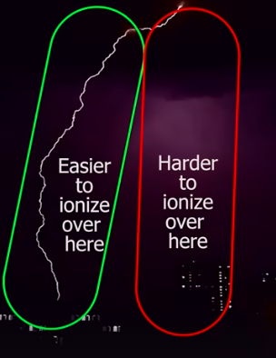

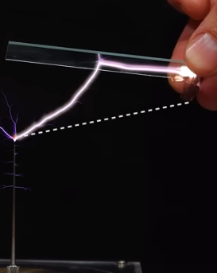

> alat mengubah listrik statis ke arus listrik adalah Van de Graaff accelerator. atau yang mendekati adalah kapasitor yang mengumpulkan listrik statis dan melepaskan dalam secara mendadak untuk memberi daya. 

alat Van de Graff memanfaatkan gaya triboelectric
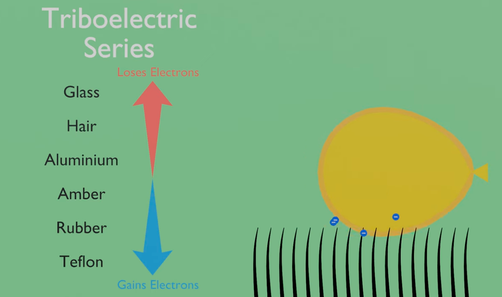
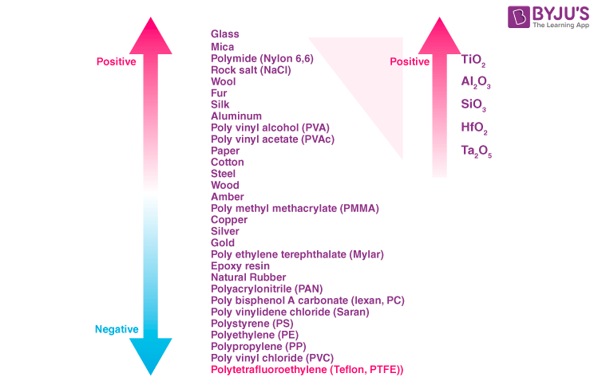
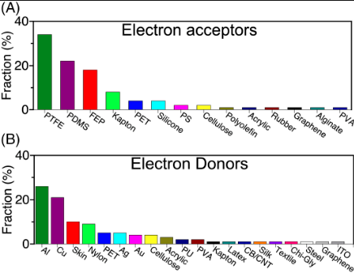
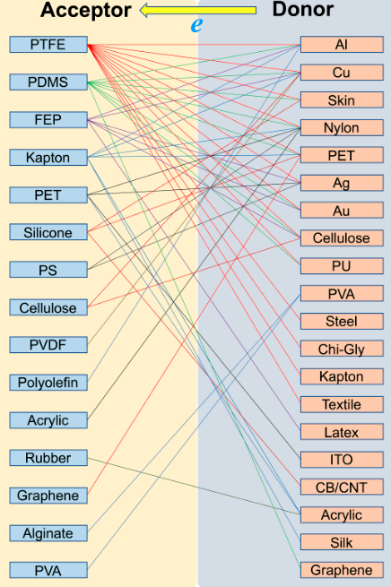

rangkaian alat
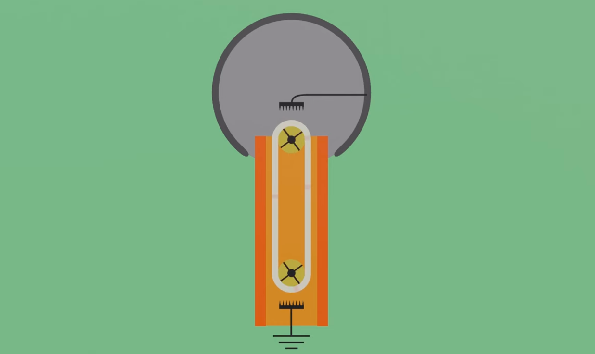
*satu sisir terhubung ke grounding, dan satu sisi terhubung ke permukaan tabung untuk akumulasi muatan positif*

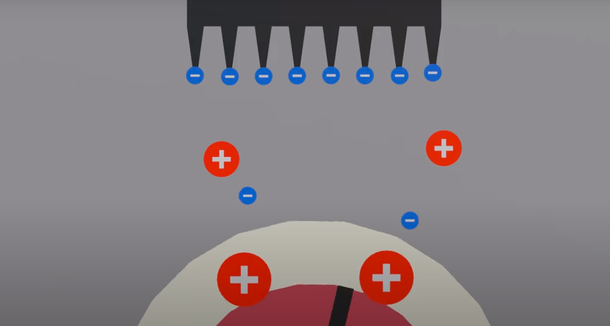
*molekul udara terionisasi*

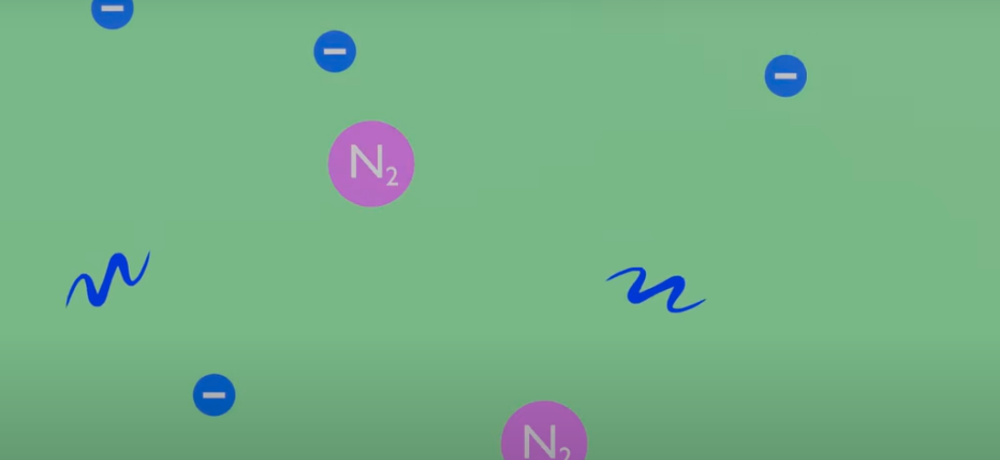
percikan lonjakan biru biasanya terjadi karena adanya elektron yang dipercat dan menabrak molekul N2

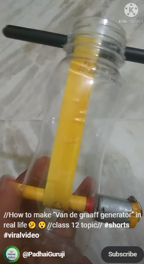
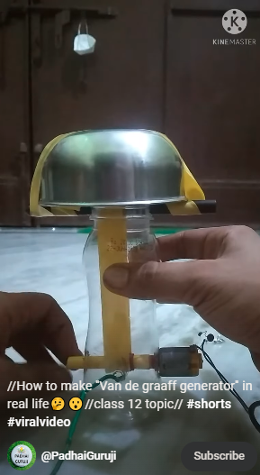
*DIY*

cara membuat[*](https://www.youtube.com/shorts/yIht_NY41YE?feature=share)

reference[*](https://physics.stackexchange.com/questions/707496/is-it-possible-to-convert-static-electricity-into-current-electricity)