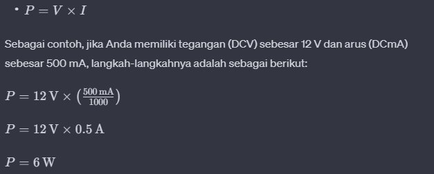

multimeter mengukur beberapa parameter arus listrik, umumnya parameter analog mengukur beberapa parameter termasuk

- DCV: mengukur tegangan (volt) listrik dari arus DC
- ACV mengukur tegangan (volt) listrik dari arus AC
- DCmA mengukur ampere listrik dari arus DC dalam satuan miliAmpere
- ohm mengukur hambatan pada sebuah konduktor

**Mengukur watt**
P = V x I
P adalah daya (watt)
V adalah tegangan (volt)
I adalah arus (ampere)

 Sebagai contoh, jika nilai tegangan (V) diberikan dalam volt dan nilai arus (I) dalam miliamper (mA), Anda harus mengonversi miliamper ke ampere dengan membagi nilainya dengan 1000, karena 1 A = 1000 mA.
 
 