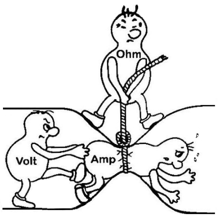

Pada dasarnya watt merupakan daya yang dibutuhkan oleh suatu benda elektronik. Sedangkan WATT dan VOLT memiliki karakteristiknya sendiri-sendiri sehingga kita tidak bisa menggabungkannya. Namun jika dilihat dari segi cara kerjanya, Watt memakan daya yang dihasilkan oleh Volt. 

volt atau tegangan listrik memiliki dua jenis yaitu AC dan DC. 

> **Rumus Tegangan (Volt)**
V = I . R
I adalah arus (ampere)
R adalah hambatan

Satuan Ampere ini sering kita jumpai pada sebuah sepesifikasi pompa air, seperti pompa air ini memiliki sepesifikasi 1 Ampere pada tegangan 220V AC. satuan ampere juga sering dimanfaatkan dalam pengaman MCB (Miniature Circuit Breaker)

**ampere** ukuran arus yang mengalir dalam rangkaian. **voltase** ukuran tekanan atau dorongan yang diberikan pada arus. **ohm** hambatan yang diberikan pada arus. 

***
Watt adalah sebuah satuan yang menunjukan sebuah nilai daya atau power bisa juga dibilang kapasitas listrik

> **Rumus Daya (Watt)**
> P = I² x R atau P = V x I
> P adalah daya (watt)
> V adalah tegangan (volt)
> I adalah arus (ampere)
> R adalah hambatan (ohm)

So, watt menyatakan besaran daya dari berbagai peralatan listrik. Sedangkan, volt menyatakan besaran tegangan listrik yang  dibutuhkan dari berbagai sumber listrik.

Watt lebih dikhususkan untuk tegangan atau daya yang dibutuhkan oleh alat elektronik. Biasanya kita memperhitungkan tegangan watt untuk memastikan kapasitas listrik itu cukup atau tidak. 
***
Apabila ada pertanyaan, “1 Volt berapa watt?” maka yang harus diketahui terlebih dahulu adalah berapa arus listriknya. Misalnya, sebuah tegangan 1 volt memiliki arus 3 ampere, maka dapat dihitung
P  = V  x I 
P = 1 x 3 = 3 watt.
***
**Ampere (A)** 
satuan untuk mengukur arus listrik yang mengalir melalui sirkuit genset. Arus ini menunjukkan jumlah energi yang digunakan atau dihasilkan oleh genset dalam bentuk listrik.

**Watt (W)** 
satuan untuk mengukur daya listrik yang dihasilkan atau dikonsumsi oleh genset. Daya listrik ini mencerminkan kapasitas genset untuk menghasilkan energi listrik yang dapat digunakan untuk menggerakkan peralatan atau beban listrik.

**Volt (V)** 
tegangan listrik yang dihasilkan oleh genset. Tegangan ini menunjukkan kuat atau lemahnya arus listrik yang dapat dihasilkan atau diterima oleh genset.