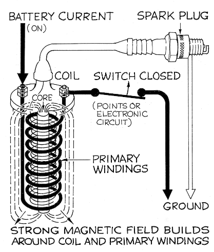
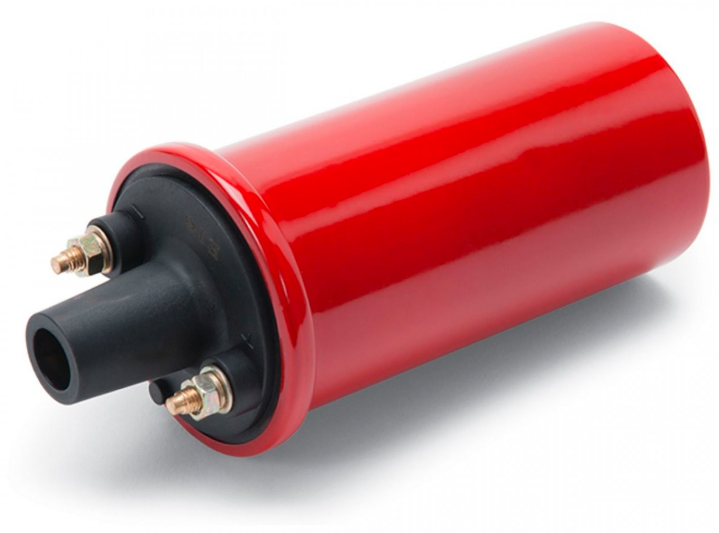
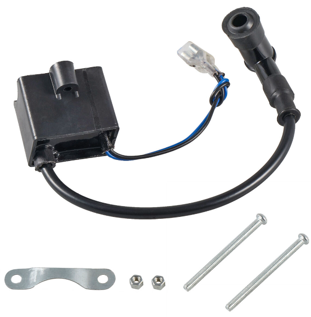

Bagaimana busi pada piston dapat memercikkan api. adalah dengan mengalirkan sebuah listrik dengan tegangan tinggi yang membuat udara di sekitar elektroda mengalami ionisasi sehingga pada ruang tersebut akan terpecikkan sebuah api. tegangan tinggi dibuat dengan membuat coil.

tegangan yang dibutuhkan sampai dapat menghasilkan ionisasi udara bervariasi tetapi umumnya antara 20.000 volt sampai 50.000 volt selain itu komposisi udara sekitar elektroda juga akan mempengaruhi variasi, misalnya campuran udara dengan bensin. dibawah merupakan ignition coil pada kendaraan motor
