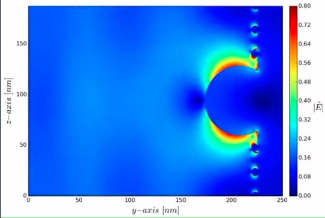

Plasmonic nanoparticles are particles whose electron density can couple with electromagnetic radiation. Plasmonic nanoparticles are particles whose electron density can couple with electromagnetic radiation

*wikipedia*
FDTD simulation of a pulsed plane wave interaction with plasmonic nanoparticles

**What differentiates these particles from normal surface plasmons is that plasmonic nanoparticles also exhibit interesting scattering, absorbance, and coupling properties based on their geometries and relative positions**

Plasmon adalah osilasi elektron bebas akibat terbentuknya dipol pada suatu bahan akibat gelombang elektromagnetik. gelombang cahaya berosilasi, menyebabkan pergeseran dipol konstan yang memaksa elektron berosilasi pada frekuensi yang sama dengan cahaya.  Kopling ini hanya terjadi bila frekuensi cahaya sama dengan atau lebih kecil dari frekuensi plasma sehingga disebut frekuensi resonansi.

Due to their ability to scatter light back into the photovoltaic structure and low absorption, plasmonic nanoparticles are under investigation as a method for increasing solar cell efficiency. Forcing more light to be absorbed by the dielectric increases efficiency

The wavelength to which the plasmon responds is a function of the size and spacing of the particles. 

the past 5 years plasmonic nanoparticles have been explored as a method for high resolution spectroscopy. One group utilized 40 nm gold nanoparticles that had been functionalized such that they would bind specifically to epidermal growth factor receptors to determine the density of those receptors on a cell