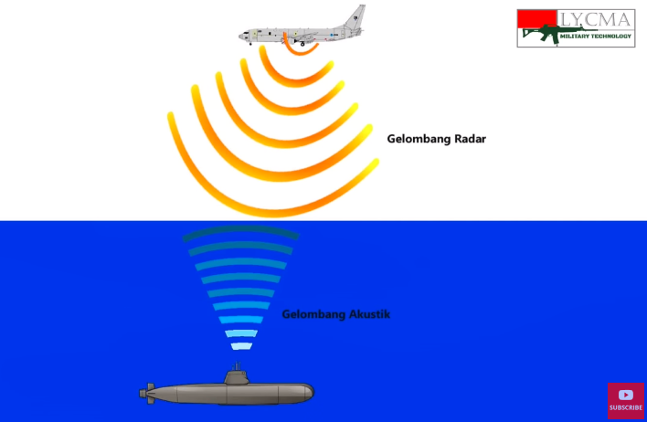
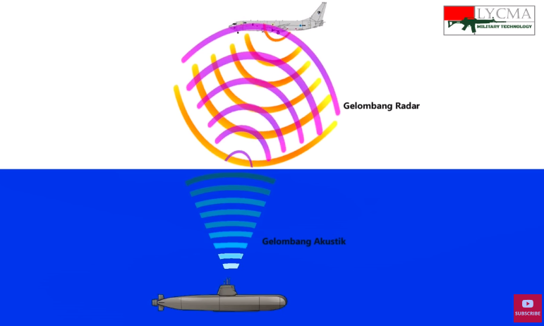

peneliti MIT sedang mengembangkan metode untuk membawa informasi melalui ultrasonik ke elektromagnetik. khususnya untuk diaplikasikan komunikasi kapal selam dengan pesat terbang

Prinsipnya adalah gelombang akustik dipancarkan ke permukaan air, kemudian kapal terbang mendektesi adanya getaran permukaan air lewat gelombang elektromagnetik, memanfaatkan refleksi gelombang elektromagnetik

tetapi masih dalam pengembangan di lingkungan ideal, yaitu lingkungan permukaan air yang tenang