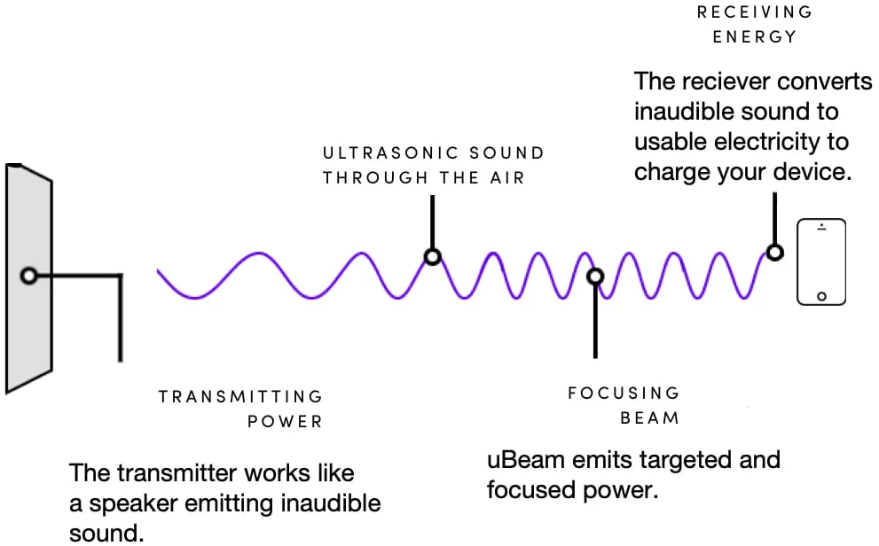
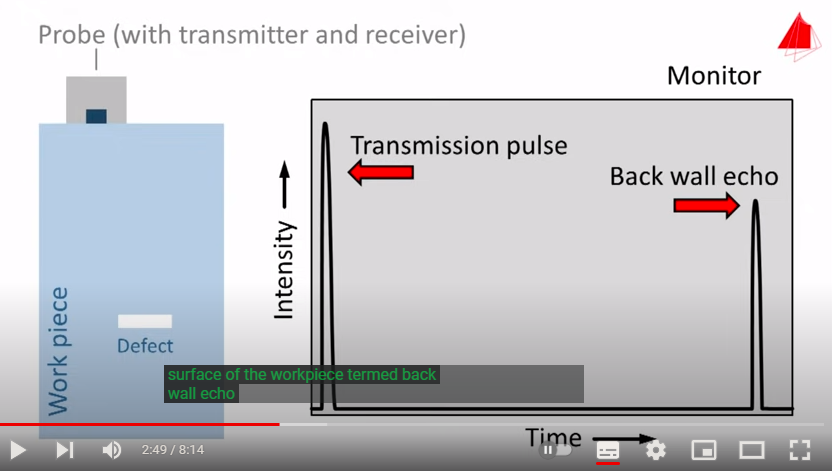
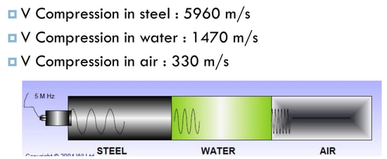

alumunium lebih banyak memantulkan gelombang daripada meneruskan. low frequency lebih baik untuk penetrasi materi, seperti anda lebih mendengar suara bass daripada treble ketika anda dibalik dinding. 

ultrasound waves propagate through a medium, the amplitude of the wave is continually reduced or weakened with the distance it travels (atenuasi). sebagian energi terbelokkan atau menjadi panas didalam medium (viskoelastik). 

pencitraan biologis memanfaatkan gelombang ini, semakin tinggi frekuensinya maka semakin tinggi resolusinya, tetapi akan memperpendek jangkauan tembusnya. 

ultrasonic waves are very similar to light waves in that they can be reflected, refracted, and focused

kecepatan suara dalam bahan tertentu adalah konstan itu adalah produk dari kepadatan dan elastisitas material
itu tidak akan berubah jika frekuensinya berubah hanya panjang gelombang yang berubah

Ketika medium yang berdekatan memiliki impedansi akustik yang hampir sama, hanya sedikit energi yang direfleksikan. Impedansi akustik memiliki peran menetapkan transmisi dan refleksi gelombang di batas antara medium yang memiliki impedansi akustik yang berbeda (Neni Wahyuni Yatarif, UI. 2008).