*Main Content*
What is CCUS and CO2 Capture
How to capture CO2 from flue gas
- chemical absorption
- adsorption
- membrane separation
what is oxy-fuel combustion and chemical looping
- oxy-fuel combustion
- chemical looping
CCUS industrial application
***
## What is CCUS and CO2 Capture
CO2 Capture, Utilization and Storage (**CCUS**). A technology that collects carbon dioxide from production activities of the energy industry and other industries and uses various methods including utilization and storage to avoid its release into the atmosphere
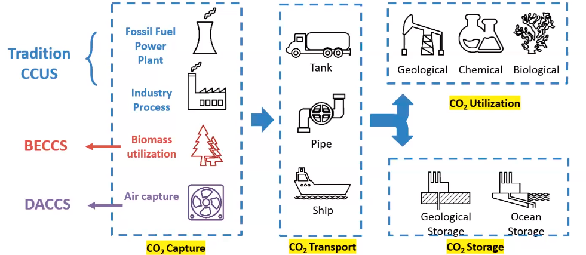

dibawah sustainable development scenario (SDS) of the global energy sector. pada 2070, dunia akan mencapai neutrality dan teknologi CCUS akan ikut berkontribusi sebesar 15% dari reduksi CO2 kumulatif. berikut adalah grafik yang memproyeksikan komposisi skenario 
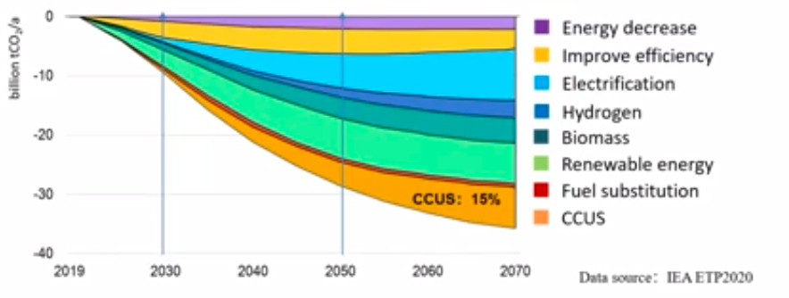

### CO2 Capture Technology
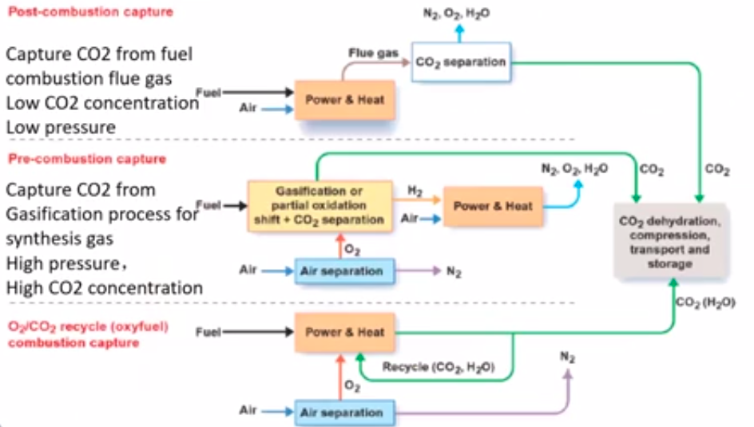

> Flue gas, adalah gas yang dihasilkan sebagai hasil dari pembakaran bahan bakar di dalam suatu proses.  umumnya terdiri dari campuran gas N2, O2, CO2, H2O, SO2, NOx dan partikel padat kecil lainya.

> Gasifikasi, proses kimia dan termal yang mengubah bahan bakar padat, cair, atau gas menjadi gas sintetis. pemanasan bahan bakar dengan pasokan oksigen yang terbatas sehingga bahan bakar tidak terbakar sempurna, melainkan akan berubah menjadi campuran gas yang lebih sederhana, seperti CO2, H2, dan CH4

> oxyfuel adalah bahan bakar yang dibakar dalam atmospher kaya oksigen. sebagian besar N2 di atmosfer dikeluarkan, meninggalkan campuran gas yang terutama terdiri dari oksigen dan karbon dioksida. teknologi ini membantu memisahkan gas buangan CO2
***
## How to capture CO2 from flue gas
**Absorption**, liquid absorption system
**Adsorption**, solid adsorption system
**membrane separation**, solid membran system
**cryiogenics**, lower temperature system

>  adsorpsi berkaitan dengan penempelan zat di permukaan zat penyerap, sedangkan absorpsi melibatkan penetrasi zat ke dalam zat penyerap dan menjadi bagian darinya.

**air**, pada temperature 20 C, 2000 tons water dissolve 1 ton of CO2
**methanol**, pada temperature -40 sampai -60 C 80 times more soluble than normal H2O) 1 ton CO2 need 12 ton methanol ini.
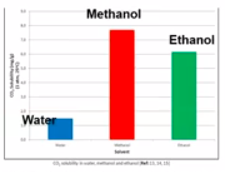

### Reaksi kimia penyerapan CO2
sodium hydroxide produce sodium bicarbonate
NaOH + CO2 > NaHCO3
Monoethanolamine or other amines produce carbamate
HO-CH2-CH2-NH2 + CO2 >
HO-CH2-CH2-NH-COO + MEAH+

sedikit tentang teknik kimia
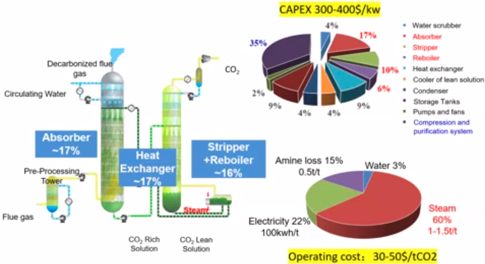

amine absorber
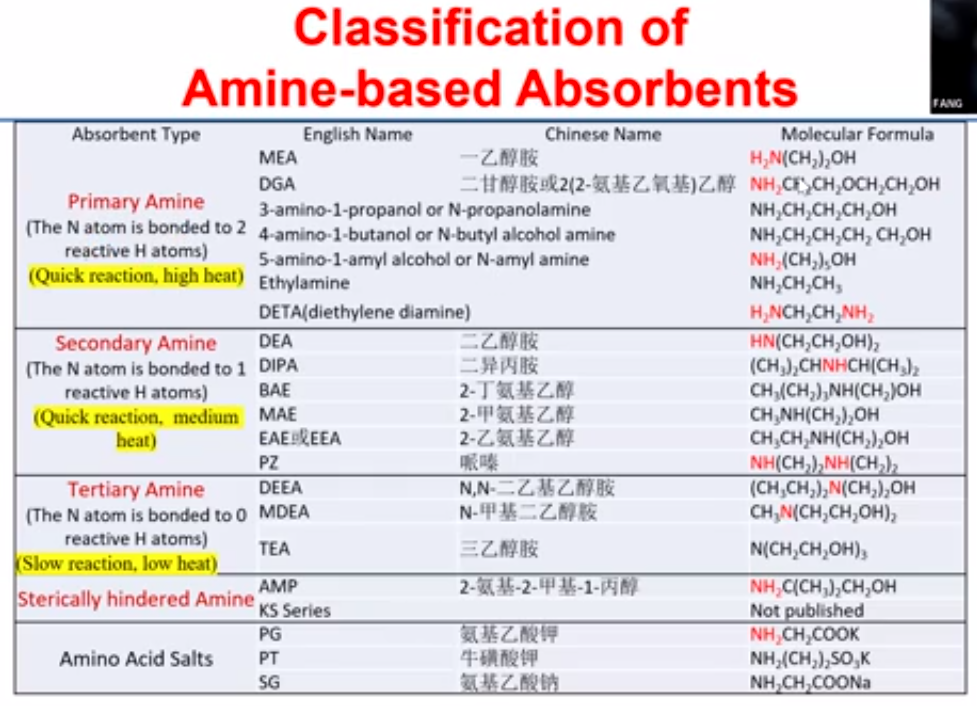

aspek yang diperhatikan ketika memilih amine
1. konsumsi energi
2. kapasitas
3. stabilitas
4. velositas
5. eco-friendly
6. price

#### Mixed Amine
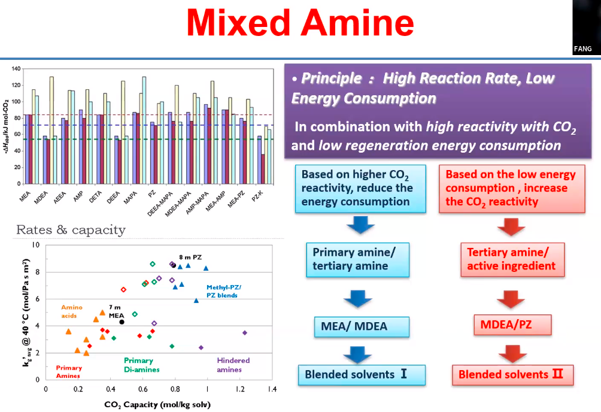
evaluasi pada percampuran amina untuk optimasi penyerapan karbon
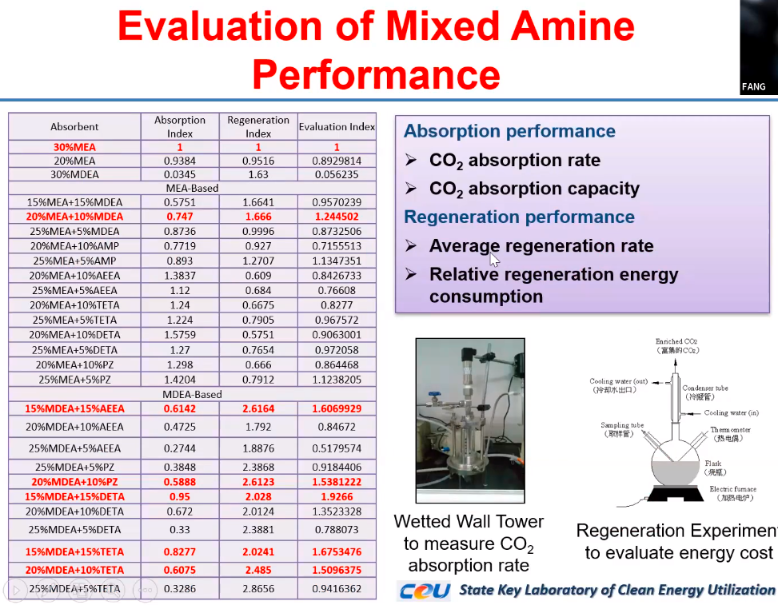
gambaran alat
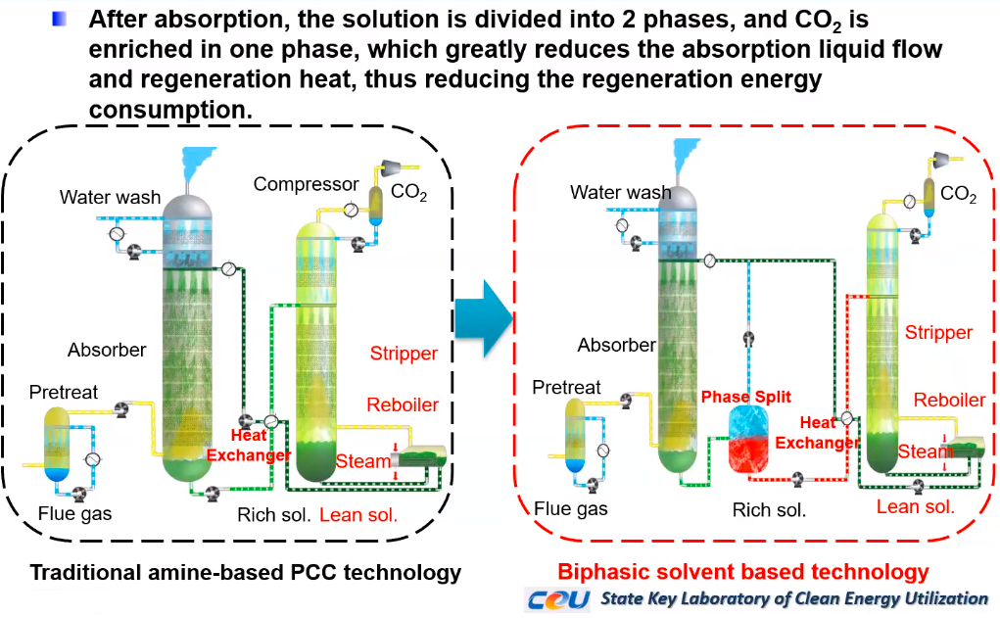
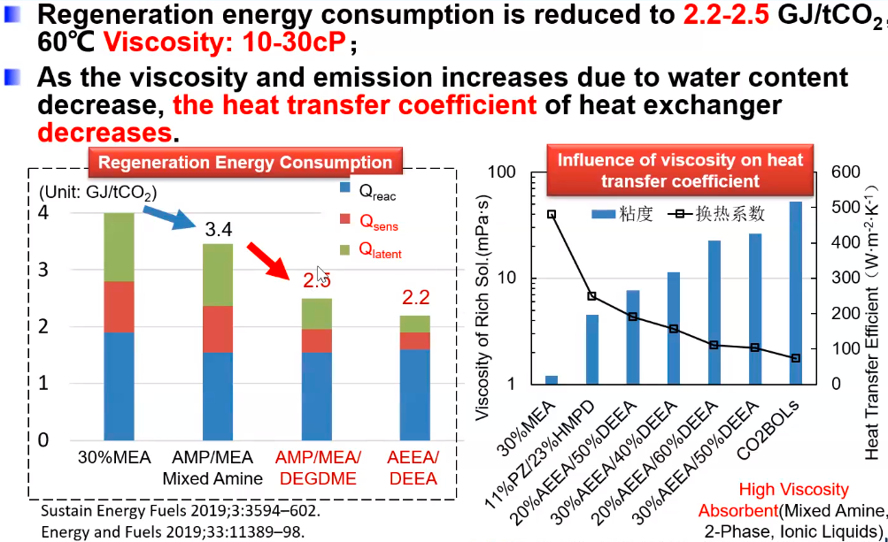

***
### Storage system
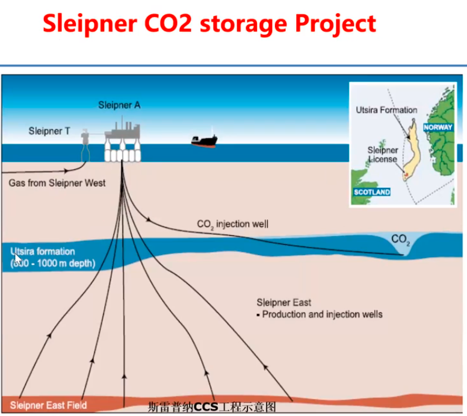

CO2 China project
company : China Shenghun Group
Scale: 100.000 tonnes per year
CO2 source: Erdos coal gasification hydrogen production equipment
Technique: CO2 chemical capture + saline aquifer storage
Transportation: CO2 tank car
Status: Total 175.000 tonnes CO2 by 2013

CO2 yang di injeksikan akan kembali membentuk sumber daya alam
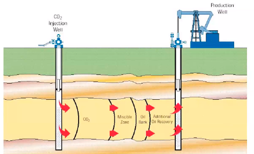
Calcium dan magnesium components in cement and industrial solid waste can fix CO2 and form carbonates
3CaO.SiO2 + 3CO2 + nH2O -> SiO2+nH2O + 3CaCO3

peningkatan kapasitas penangkapan CO2 di china
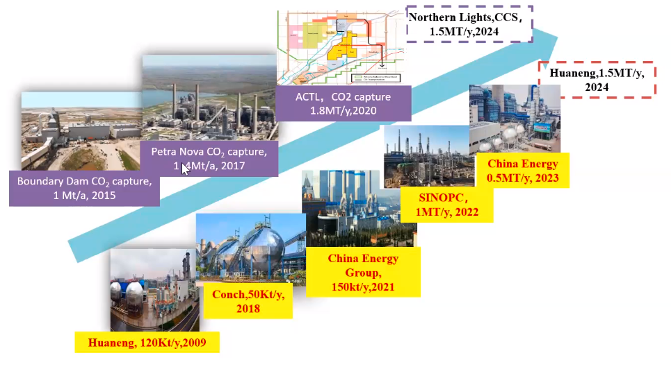

# Conclusion
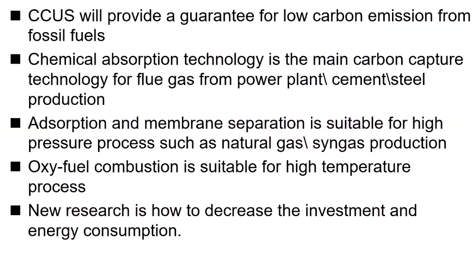