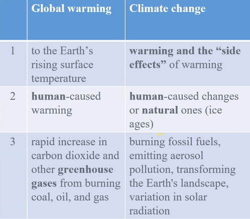

Global warming vs climate change

earth has two sources of energy, heat from sun and heat from its interior

efek rumah kaca menyebabkan sinar matahari yang masuk, ketika akan keluar tetapi memantul kembali kedalam bumi.

