## Perlukan krisis iklim diatasi?
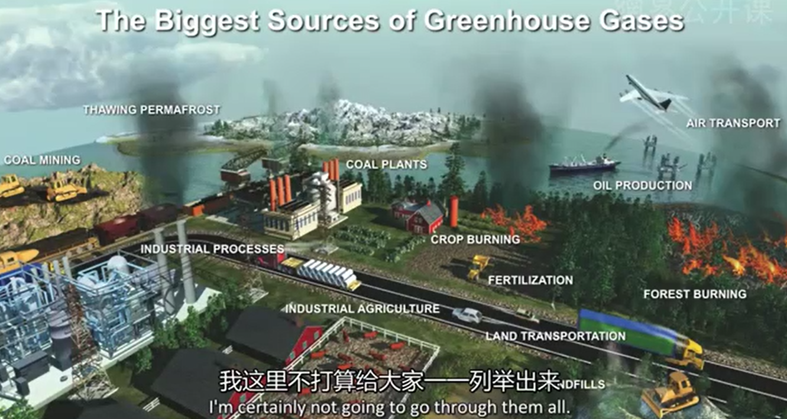
400.000 kali dampak yang ditimbulkan oleh bom Hiroshima terhadap pemanasan global. 

Kurva temperatur telah bergerak

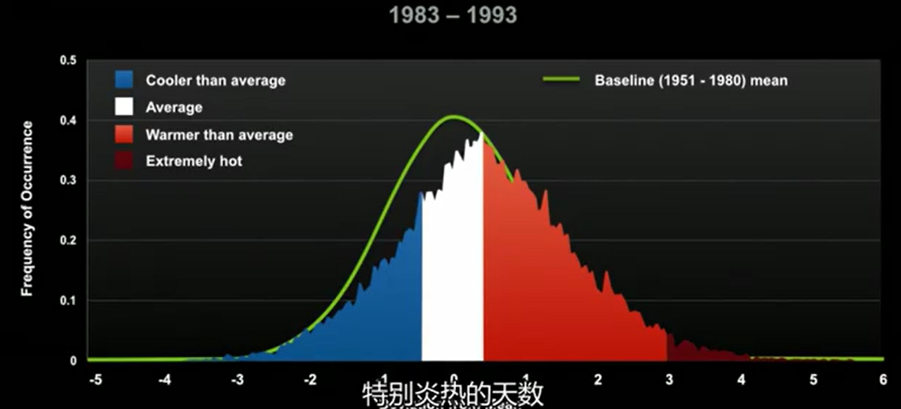	
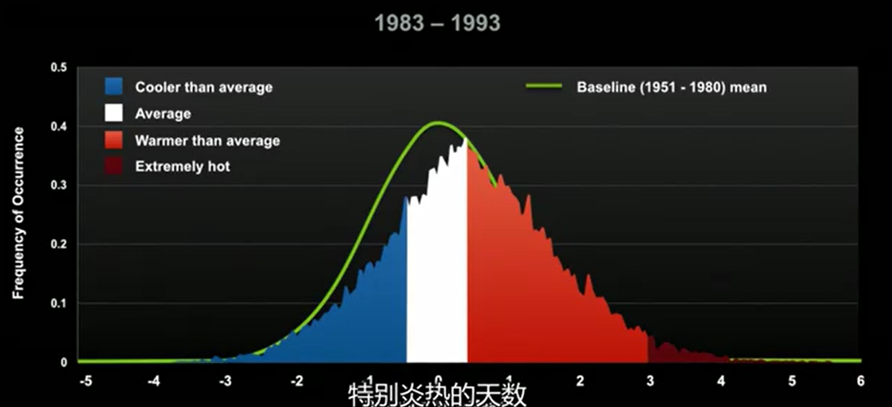
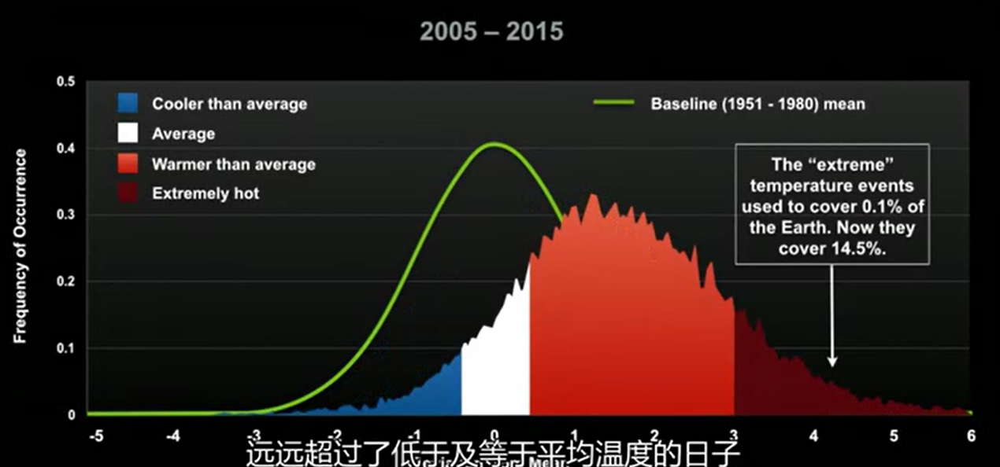

pemanasan akan berdampak pada manusia, hewan, ekosistem, planet. grafik untuk peningkatan permukaan air pada planet bumi akibat gletser yang meleleh
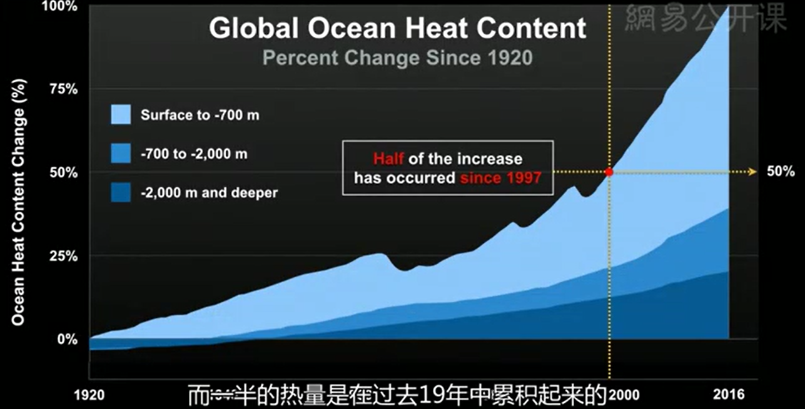

seiring temperature naik, maka laut akan semakin cepat untuk menguap sehingga membuat seperti sungai di langit. salah satu bencana yang terjadi karena waterfall dari langit. 
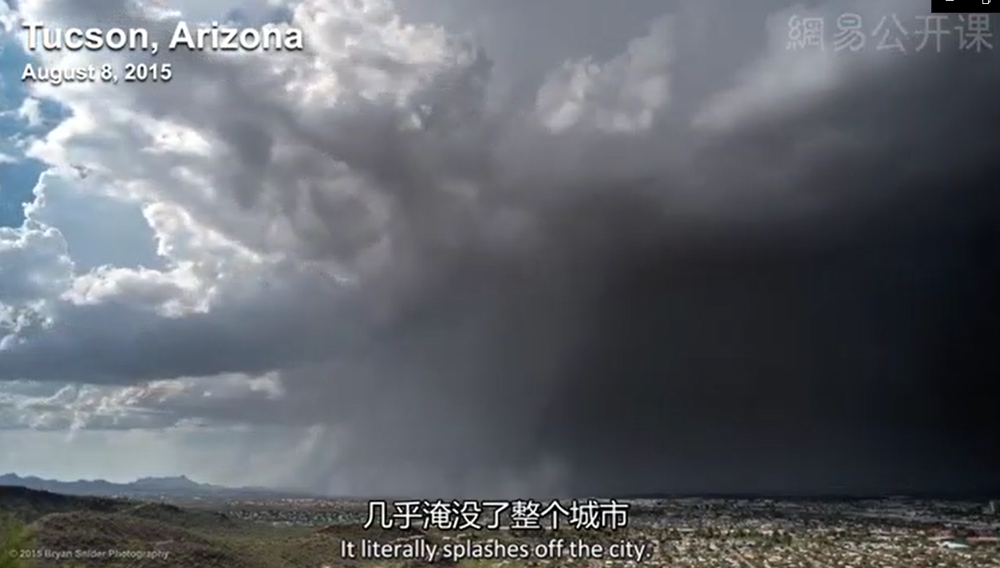
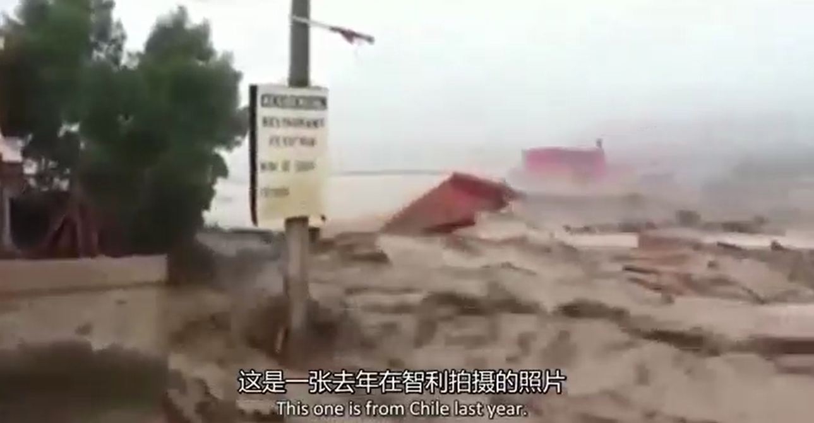
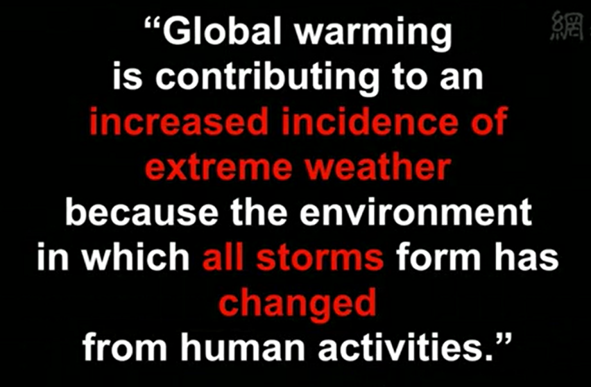

pada tahun 2006, perubahan cuaca telah mengubah 60% lahan menjadi kekeringan yang menyebabkan banyak tanamana disana mati. 

perubahan iklim juga akan membawa virus tropikal menyebar ke seluruh penjuru dunia. 
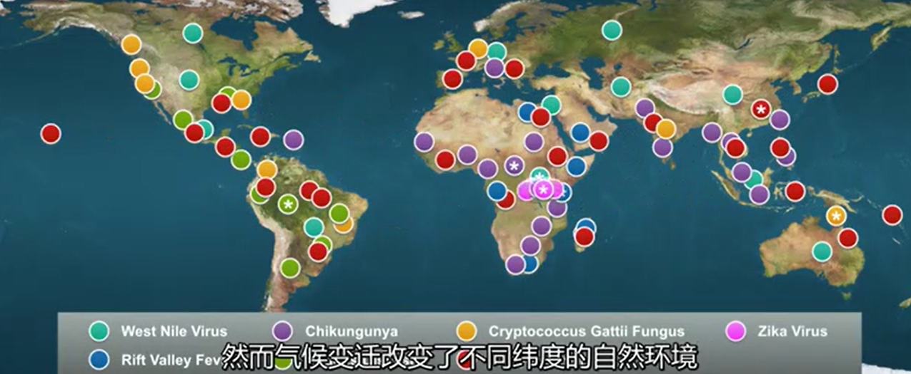

Menurut world ecomomi forum, krisis iklim menjadi ancaman nomor satu terhadap ekonomi global. 

## Dapatkah kita mengatasi
yes, we can.
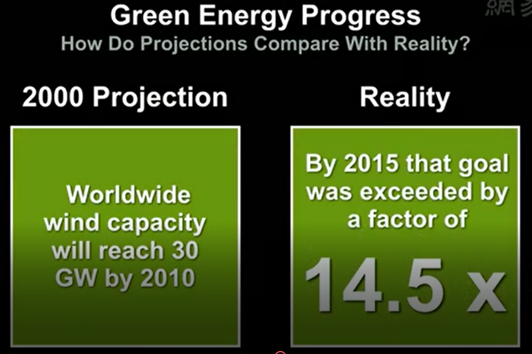
biaya instalasi turbin angin menurun sepanjang tahun, dan efektifitas untuk menghasilkan listrik meningkat secara eksponensial. 

tren harga bahan pokok penyimpanan energi
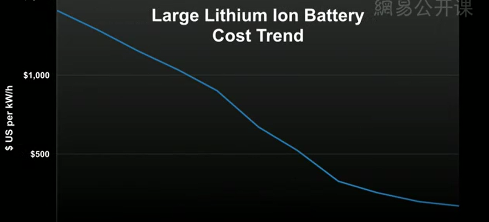

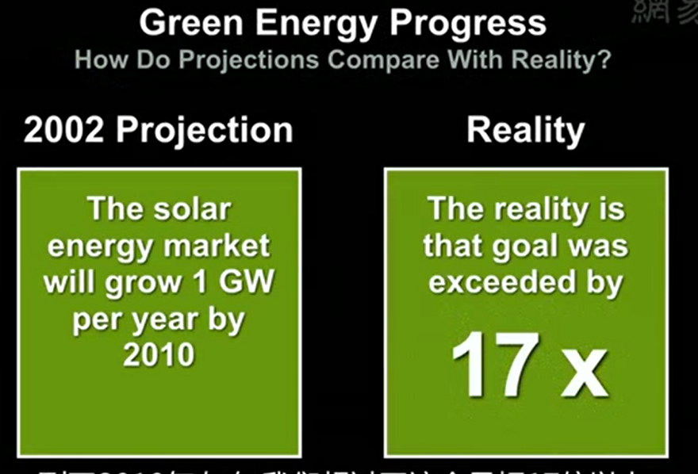
tren pemasangan solar panel. 
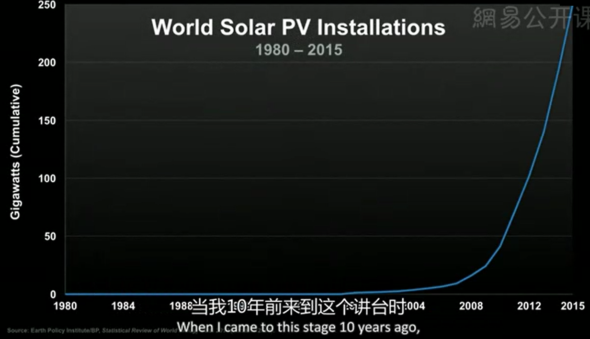
dengan biaya instalasi yang semakin menurun. 

apabila energi nuklir dapat diterima dengan baik dan memiliki standar yang lebih baik, sektor ini akan memberikan sumbangan energi yang lebih dramatis lagi.

perbedaan tren pemakaian cellphone di negara berkembang dan maju
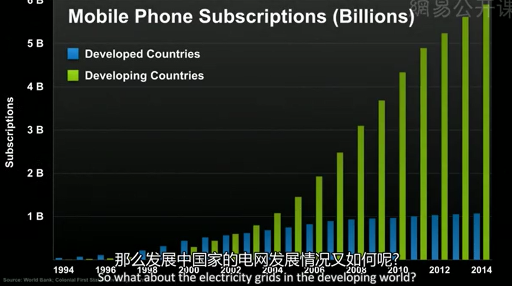

Muhammad yunus membuat solar panel tanpa investor di bangladesh.
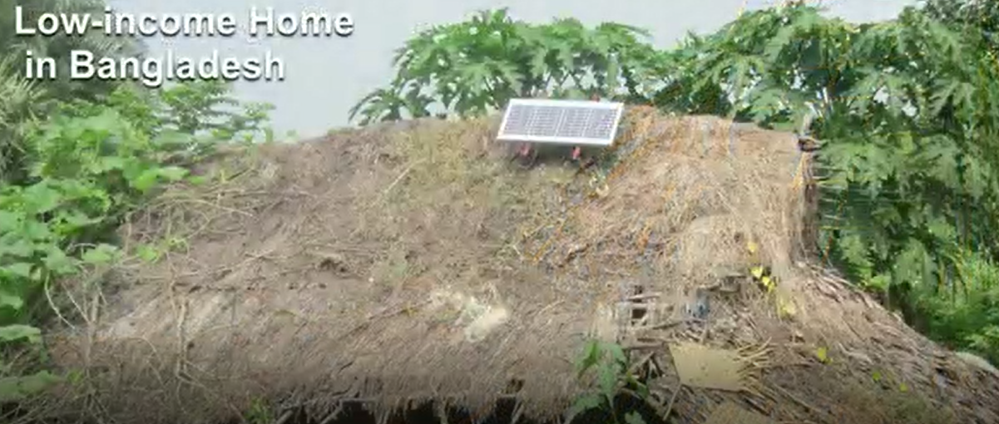

## Apa yang kita ubah
pada tahun 2015, Paris Agreement, setiap negara di dunia setuju untuk menghilangkan gas rumah kaca. akibatnya di amerika sendiri rencan untuk pembangunan batu bara dibatalkan.
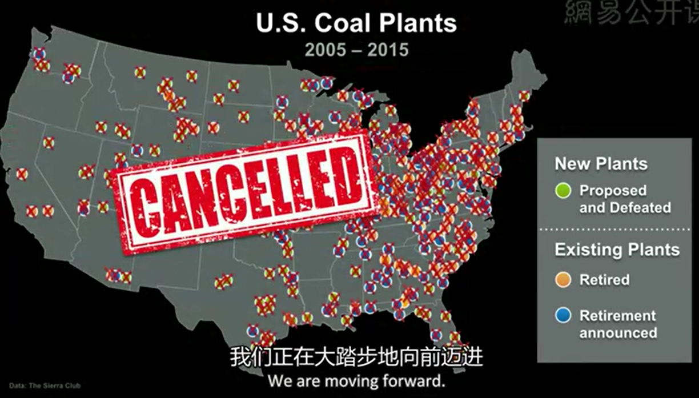
dan diganti dengan komposisi sebagai berikut
