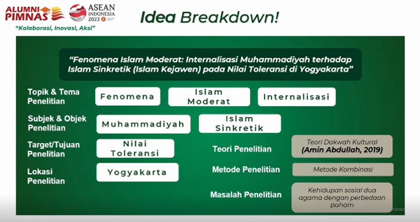
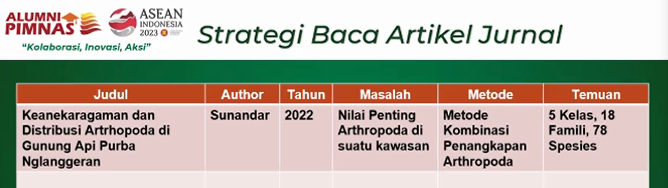

### PIMNAS
1. penilaian proposal 30%, termasuk format dan konten
2. penilaian laporan kemajuan 30%
3. penilaian monev (PKP2) 30%

menuju pimnas

Brainstrooming
1. explorasi fakta
2. menemukan masalah (optimaliasi)
3. solusi
4. 
Sumber Topik Unggulan berasal dari Sustainable Development Goals, SDGs.

kemudian dilakukan idea breakdown. presenter mengatakan judul yang diangkat merupakan pengembangan dari team yang lolos PIMNAS beberapa tahun lalu. presenter mengamati pola judul-judul proposal dan menganalisa aspek apa saja yang disukai. 

kemudian dilakukan Idea breakdown

presenter mengemukakan paling tidak variabel yang perlu dimuat dalam judul proposal

- topik dan tema penelitian
- subjed dan objek
- tujuan penelitian
- lokasi penelitian

strategi mengumpulkan referensi

R discovery mungkin akan membantu anda menemukan journal. 

### Penentuan kelompok team
- berbeda angkatan
- berbeda jurusan atau fakultas
- dosen pembimbing yang tepat
- kecakapan dan linearitas ketua
- pantang menyerah dan mau belajar

> PKM banyak tantangan

`sesuaau yang sudah diatur jangan dilanggar, sesuatu yang tidak diatur boleh disajikan selama tidak melanggar yang sudah diatur`

