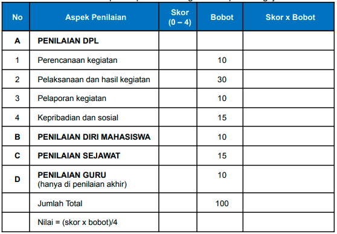

penilaian meliputi penilaian DPL, penilaian mandiri, penilaian sejawat, dan penilaian guru pamong.

Penilaian dilakukan dengan mengisi skor pada laman MBKM sesuai dengan instrumen yang telah disusun. Nilai tersebut akan terakumulasi di sistem sehingga menghasilkan nilai akhir.

Kriteria kelulusan adalah
1. mengikuti seluruh rangkaian kegiatan kampus mengajar
2. menunjukkan perilaku baik 
3. mendapatkan nilai minimal 2,00 pada skala 4,00

konversi: yang diupload adalah laporan capaian mata kuliah yang diajukan konversi

Boleh mengajukan konversi pada semester berapapun. 

tidak dilakukan KRS, tetapi akan dimasukkan dari tim RPL UNY. jika anda mengikuti penilaian dari dosen, bisa jadi anda malah mendapat nilai E. 

jika anda ingin konversi di semester x, maka anda perlu mengosongkan sebesar nominal sks konversi di semester x tersebut. (menyediakan slot)

