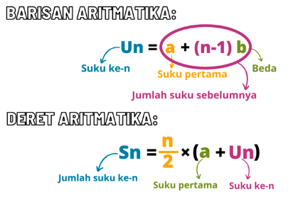

Baris aritmatika untuk mengetahui nilai pada suku tertentu

Deret Aritmatika untuk mengetahui jumlah nilai sampai suku tertentu

misalnya ada deret 0, 3, 6, 9, 12, 15, ...

maka baris aritmatika suku ke 3 adalah 6
maka deret aritmatika suku ke 3 adalah 0 + 3 + 9

misal disuruh menentukan suku atau baris dan deret ke 100, maka akan susah harus menghitung manual, maka dibuatkan sebuah rumus, rumus sebenarnya adalah alat untuk memudahkan menyelesaikan masalah 

> misalnya rumus kecepatan, membantu kita menghitung seberapa cepat sesuatu bergerak. Rumusnya adalah "jarak dibagi waktu." Jadi, jika kamu berlari sejauh 20 meter dalam waktu 10 detik, kecepatanmu adalah 20 meter / 10 detik = 2 meter per detik.

oke kembali ke baris dan deret aritmatika.
untuk menghitung baris aritmatika suku ke 100
Un = a+(n-1)b
a, adalah suku pertama, b adalah beda atau selisih antara suku berdekatan
U100 = 0+(100-1)3 = 0 + (99)3 = 297
Jadi. baris ke 100 atau suku ke 100 adalah 297

untuk menghitung deret aritmatika suku ke 100
Sn = n/2*(a+Un)
a, adalah suku pertama, Un adalah baris pada n, 
S100 = 100/2*(0+297) = 50*(297) = 14.850
Jadi. deret ke 100 atau jumlah suku sampai 100 adalah 14.850

***
> cukup mempersiapkan saja, tidak usah berekspektasi bahwa murid akan antusias, tetapi berusaha dengan persiapan yang matang