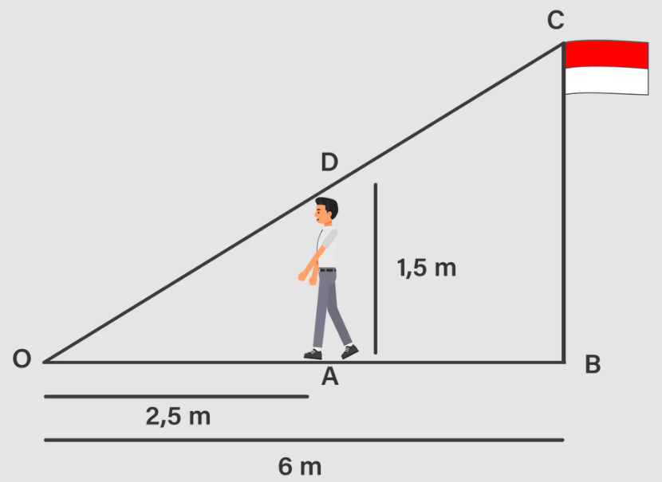

# Mengukur tiang bendera dengan perbandingan

Berapa tinggi tiang bendera merah putih?

$(\frac{2,5}{1,5} = \frac{6}{x})$
$(x \cdot \frac{2,5}{1,5} = \frac{6}{x})$

..
..
..

Di sisi kanan, \(x\) akan dibatalkan dan hanya akan tersisa:

\(x \cdot \frac{5}{3} = 6\)

Langkah 4: Sekarang, kita perlu mengisolasi \(x\). Kita dapat melakukannya dengan membagi kedua sisi dengan \(\frac{5}{3}\):

\(x \cdot \frac{5}{3} \div \frac{5}{3} = 6 \div \frac{5}{3}\)

Ini akan menghasilkan:

\(x = 6 \div \frac{5}{3}\)

Langkah 5: Bagi \(6\) dengan \(\frac{5}{3}\). Bagi bilangan pecahan adalah sama dengan mengalikan dengan kebalikan dari pecahan tersebut. Jadi:

\(x = 6 \cdot \frac{3}{5}\)

Sederhanakan perkalian ini:

\(x = \frac{18}{5}\)

Jadi, solusi dari persamaan \(\frac{2.5}{1.5} = \frac{6}{x}\) adalah \(x = \frac{18}{5}\) atau dalam bentuk desimal \(x = 3.6\).