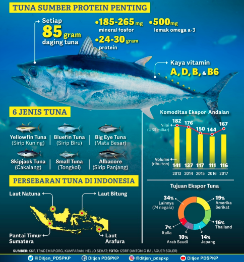
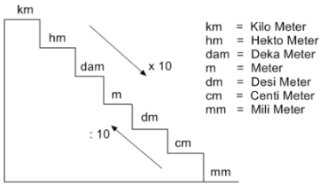
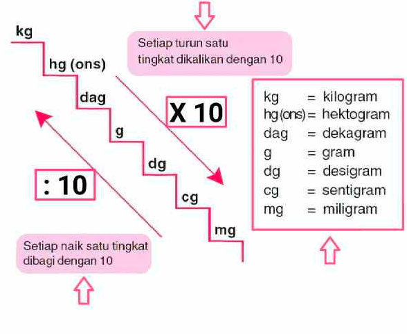
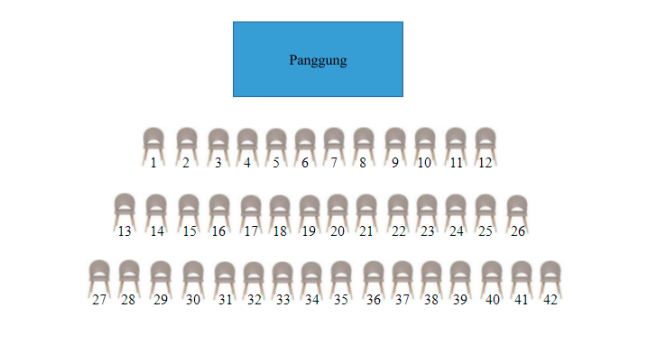

***

# 1. pernyataan yang benar

> di singkat menjadi 'Kang Ha Dam Mi Dak Semut' ❎✅

diubah menjadi 

265 **miligram** mineral fosfor 
500 **miligram** omega  
30 **gram** protein  = 30 x 1000 = 30.000 **gram** protein 

30.000 > 500 > 265
protein > omega > mineral fosfor

a. Kandungan gizi paling banyak yang terdapat pada ikan tuna adalah protein ✅

b. Ikan tuna lebih banyak mengandung mineral fosfor dibandingkan dengan lemak omega ❌

c. Kandungan gizi paling banyak yang terdapat pada ikan tuna adalah mineral fosfor. ❌

d. Ikan tuna lebih banyak mengandung protein dibandingkan dengan mineral fosfor ✅

# 2. Jika pada tahun 2013, satu dolar amerika sama dengan Rp10.000,00, nilai ekspor tuna Indonesia pada tahun 2013 adalah
Dolar adalah mata uang negara amerika, Ringgit adalah mata uang malaysia, sedangkan di indonesia namanya adalah rupiah. nilai mata uang setiap negara adalah tidak sama. 5000 rupiah di indonesia untuk membeli sosis so nice dapat 5, tetapi 5000 rupiah di amerika hanya dapat 1. dan nilainya itu berbeda-beda tiap tahun bisa naik atau turun.

dalam soal disebutkan bahwa pada tahun 2013, satu dolar sama dengan 10.000 rupiah. 

dalam poster disebutkan bahwa ekspor ikan tuna pada tahun 2013 adalah 182 miliar dolar. maka agar menjadi rupiah, maka 182 x 10.000 = 1.820.000 miliar rupiah = 1.820 triliun rupiah

***

# 3. Pasangkan setiap baris kursi di dalam ruang pertunjukan dengan banyaknya kursi!
pada baris pertama terdapat 12 kursi
pada baris kedua terdapat 14 kursi
pada baris ketiga terdapat 16 kursi

berapa jumlah kursi pada baris ke 6
berapa jumlah baris pada kursi ke 10
berapa jumlah baris pada kursi ke 15

n adalah nomor baris
d adalah selisih antar baris

jawab jumlah kursi pada baris ke 6
a6   = 12 + (6 - 1)2 = 12 + (5)2  = 12 + 10 = 22
a10 = 12 + (10-1)2 = 12 + (9)2  = 12 + 18 = 30
a15 = 12 + (15-1)2 = 12 + (14)2= 12 + 28 = 40

angka-angka tersebut membentuk sebuah pola, dari 12, ke 14, ke 16. bagaimana mengetahui bahwa itu adalah pola?

dengan mencari selisih data ke-1, ke-2, ke-3. 

selisih baris ke-1 dan ke-2 adalah 2
selisih baris ke-2 dan ke-3 adlaah 2

apakah selisih antara data-data tersebut adalah sama (konstan) jika iya maka angka-angka tersebut adalah pola. 

jawabanya adalah iya, karena selisih setiap baris kursi adalah +2

lalu berapa jumlah kursi pada baris ke-3?
jumlah kursi baris ke-3 adalah jumlah kursi baris ke-2 + 2 = 14 + 2 = 16

lalu berapa jumlah kursi pada baris ke-4?
jumlah kursi baris ke-4 adalah jumlah kursi baris ke-3 + 2 = 16 + 2 = 18

lalu berapa jumlah kursi pada baris ke-5?
jumlah kursi baris ke-5 adalah jumlah kursi baris ke-4 + 2 = 18 + 2 = 20

### Contoh soal
1,3,5,7,...
berapa nilai pada baris ke-5?

diketahui:
nilai baris ke-1 adalah 1
nilai baris ke-2 adalah 3
nilai baris ke-3 adalah 5
nilai baris ke-4 adalah 7

ditanya:
nilai pada baris ke-5 adalah....

jawab:
selisih baris ke-1 dan ke-2 adalah 2 
selisih baris ke-2 dan ke-3 adlaah 2 
selisih baris ke-3 dan ke-4 adalah 2 

> selisih adalah perbedaan, misalnya perbedaan bilangan 1 dan 3 adalah 2, misalnya perbedaan bilangan 1 dan 9 adalah 8.

pola yang membentuk baris tersebut adalah +2  
nilai baris ke-5 adalah 7 + 2 = 8

11,17, 23, 29, 35,...
22, 19, 16, 13, 10, ...

### Latihan soal
5,10, 15, 20, 25,...
8,16,24,32, 40,...
1,5,9,13,...
16, 12, 8, 4, ...

berapa nilai bilangan pada baris ke 7 dari pola berikut
9,18, 27, 36, 43,...

berapa nilai bilangan pada baris ke 6 dari pola berikut
2,6,10,14,...

misalnya:
berapa nilai bilangan pada baris ke 57 dari pola berikut
12,24,36,48,...

rumus

n adalah nomor baris
d adalah selisih antar baris
a57 = 12 + (57 - 1)12
a57 = 12 + (56)12
a57 = 12 + 672
a57 = 684

misalnya:
Di pertambangan batu bara, seorang penambang 
pada hari ke-1 mendapatkan 6 ton batu bara, pada hari ke-2 mendapatkan 9 ton batu bara,
pada hari ke-3 mendapatkan 12 ton batu bara
berapa banyak penambang tersebut mendapatkan batu bara pada hari ke 100?

a100 = 6 + (100 - 1)3
a100 = 6 + (99)3
a100 = 6 + 297
a100 = 303

jadi penambang batu bara mendapatkan 303 ton pada hari ke 100. 

# 4. Harga tiket untuk setiap baris berbeda. Harga tiket untuk kursi pada baris pertama adalah Rp200.000,00, baris kedua Rp190.000,00, baris ketiga Rp180.000,00, dan seterusnya. Harga tiket untuk kursi dengan nomor 100 adalah ....
pahami konteksnya, bahwa yang ditanyakan adalah berapa harga tiket untuk kursi dengan **nomor 100**. yang ditanyakan adalah kursi dengan nomor 100 itu dibaris berapa?

adalah dengan mengecek satu persat

baris ke-1 ada 12 kursi, 0 + 12 = 12
baris ke-2 ada 14 kursi, 12 + 14 = 26
baris ke-3 ada 16 kursi, 14 + 16 = 
