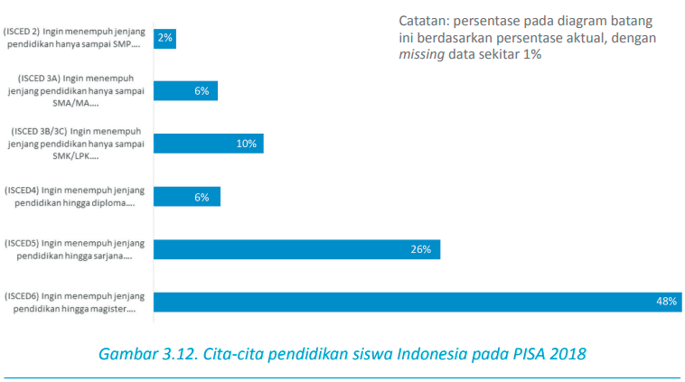

[*](https://repositori.kemdikbud.go.id/16742/1/Laporan%20Nasional%20PISA%202018%20Indonesia.pdf)

Remaja adalah masa ketika siswa mulai berpikir lebih serius tentang masa depan mereka; ketika aspirasi mereka lebih sejalan dengan minat, keterampilan, dan kesempatan yang ada; dan ketika visi tentang diri sendiri dapat dipengaruhi oleh teman sekolah dan orang-orang dewasa di sekeliling mereka (Beal and Crockett, 2010). Cita-cita siswa akan masa depan memengaruhi pilihan studi dan aktivitas yang digeluti, yang pada akhirnya menentukan pencapaian hasilnya (Nurmi, 2004).

aspirasi menempuh jenjang pendidikan

Beal, S.J. and Crockett, L.J. (2010), “Adolescents’ Occupational and Educational
Aspirations and Expectations: Links to High School Activities and Adult Educational
Attainment”. Faculty Publications, Department of Psychology, pp. 491. http://
digitalcommons.unl.edu/psychfacpub/491

Nurmi J. (2004) Sosialization and self-development. Channeling, selection, adjustment,
and reflection.R. Lerner, L. Steinberg (Eds.), Handbook of adolescent psychology
(2nd ed.), John Wiley & Sons, Hoboken, NJ (2004), pp. 85–124