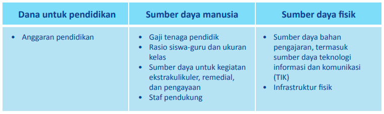
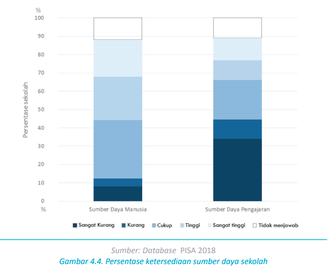
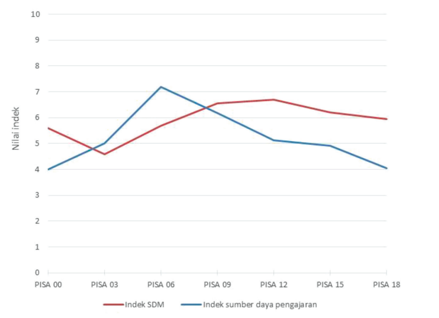
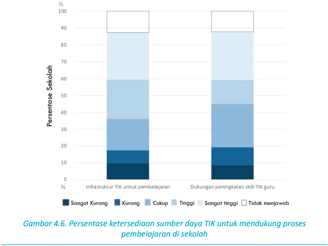
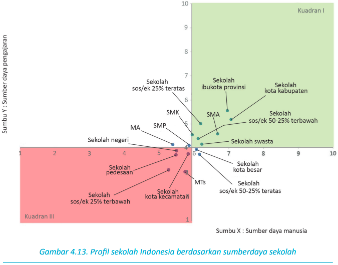
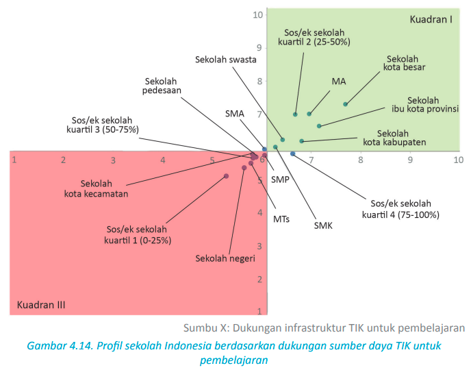
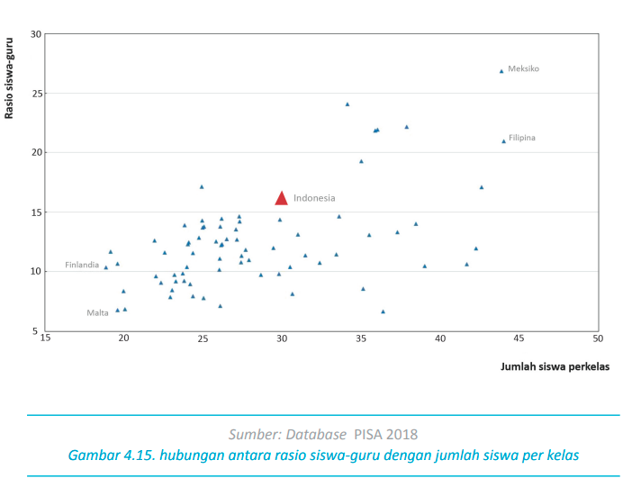
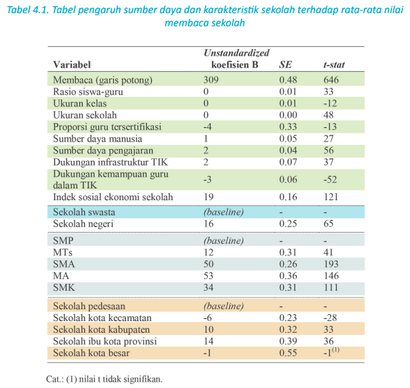

Laporan Nasional PISA 2018[*](https://repositori.kemdikbud.go.id/16742/1/Laporan%20Nasional%20PISA%202018%20Indonesia.pdf)

# Kalimat tergaris bawah
1. Indonesia berhasil mencapai salah satu dari target kunci SDG bidang pendidikan dengan menganggarkan dana pendidikan lebih dari 20% dari anggaran pendidikan dan belanja negara (APBN)
2. Kelompok sekolah ibukota provinsi cenderung memiliki rasio guru-siswa yang tinggi 
3. Kelompok sekolah dengan rata-rata indek sosial/ekonomi yang rendah cenderung memiliki sumber daya pengajaran dan sumber daya manusia yang rendah dibandingkan rata-rata Indonesia. Sedangkan sekolah-sekolah di ibukota provinsi dan kota kabupaten cenderung memiliki sumber daya manusia dan sumber daya pengajaran diatas rata-rata Indonesia.
4. Kelompok sekolah dengan ratarata indek sosial/ekonomi rendah memiliki dukungan infrastruktur TIK untuk pembelajaran dan dukungan peningkatan skill TIK guru yang rendah. Sebaliknya, kelompok sekolah kota besar memiliki dukungan infrastruktur TIK untuk pembelajaran dan dukungan peningkatan skill TIK guru yang tinggi.
5. Secara umum, sumber daya sekolah memiliki asosiasi yang kuat dengan rata-rata kemampuan membaca pada tingkatan sekolah, akan tetapi memiliki sumbangsih yang relatif kecil terhadap rata-rata nilai membaca sekolah
6. SMP swasta yang ada di kecamatan memiliki kemampuan membaca rendah dua kali tahun ajaran pendidikan daripada SMA yang berada di ibukota provinsi

#### Sumberdaya alam (fisik) dan sumberdaya manusia
Sumber daya fisik meliputi sarana prasarana pendidikan, komputer, dan ukuran sekolah sedangkan sumber daya manusia meliputi komponen gaji, pelatihan, rasio guru-siswa. 

# Anggaran pendidikan
sesuai anjuran SDGs bidang pendidikan, Indonesia telah menganggarkan dana pendidikan lebih dari 20% dari APBN

UNESCO mendorong pemerintah meningkatkan proporsi anggaran pendidikan di APBN 2030, dari sekitar 3% menjadi 5% untuk negara berpendapatan rendah, dan dari 4% menjadi 6% negara-negara berpendapatan menengah.

>  Indonesia telah kembali menjadi negara berpenghasilan menengah atas.

sesuai dengan pasal 31 UUD 1945 Amandemen, Anggaran pendidikan Indonesia pada 2015 sebesar 20,5%

alokasi anggaran untuk sumberdaya manusia dan sumberdaya fisik

# Sumber daya
OECD membuat indeks sumber daya manusia dan sumber daya pengajaran. Indonesia memiliki indeks SDM 6 dan sumber daya pengajaran 4. Hal ini menunjukkan sekolah-sekolah di Indonesia relatif memiliki SDM yang cukup, tetapi kekurangan dalam sumber daya pengajaran.

Sebanyak 8% sekolah mempunyai SDM sangat rendah dan 34% sekolah mempunyai sumber daya pengajaran sangat rendah. 20% sekolah memiliki SDM sangat tinggi dan 12% sekolah
memiliki sumber daya pengajaran sangat tinggi

Aspek eknomi siswa berkontribusi 
6% terhadap SDM
7% terhadap sumber daya pengajaran

terjadi tren penurunan indeks sumber daya pengajaran

nilai sumber daya teknologi informasi komunikasi untuk indonesia adalah 6 (skala 10). 18% sekolah kekurangan dukungan infrastruktur  dan 20% kekurangan dukungan peningkatan kemampuan TIK untuk guru.

Sebesar 51% sekolah di Indonesia memberikan dukungan infrastruktur TIK untuk kegiatan belajar mengajar. 12% sekolah mempunyai sumber daya pengajar yang kurang menguasai TIK sekaligus tidak memiliki waktu untuk menyiapkan bahan pembelajaran yang terintegrasi dengan TIK. 5% sekolah memiliki guru yang menguasai TIK tetapi tidak punya cukup waktu untuk mengaplikasikan kemampuan mereka di dalam proses belajar mengajar

### Keragaman SDM dan sumber daya pengajaran
sebanyak 4 indeks ditetapkan PISA untuk  menganalisis keragaman sumber daya di
sekolah. 
1. Ketersediaan dan kualitas SDM pengajar
2. ketersediaan dan kualitas sumber daya pengajaran
3. Ketersediaan dan kualitas SDM TIK pengajar
4. Ketersediaan kualitas sumber daya pengajaran TIK

> PISA mengalokasikan indeks tersendiri untuk SDM TIK pengajar dan sumber daya pengajaran TIK

kuadran II mengindikasikan sekolah tersebut memiliki indeks lebih rendah dari pada rata-rata indeks nasional baik SDM maupun sumber daya pengajaran. contoh pembacaan untuk sekolah MA, yaitu memiliki SDM dibawah rata-rata indeks nasional dan memiliki sumberdaya pengajaran diatas rata-rata indeks nasional.

Rasio siswa-komputer merupakan indikator sederhana mengenai jumlah komputer yang
tersedia untuk siswa. Rasio ini dihitung melalui pembagian jumlah siswa di kelas sembilan atau sepuluh di sekolah dengan jumlah total komputer di sekolah. 

pada PISA 2015 rasio siswa-komputer adalah 10:1 (10 siswa-1 komputer) pada PISA 2018  rasio siswa-komputer adalah 4:1. Penurunan tersebut dimungkinkan adanya kebijakan diselenggarakan ANBK. 

> mungkinkah pengadaan komputer hanya digunakan untuk pelaksanaan ANBK semata?

Sekolah di wilayah perkotaan cenderung
memiliki rasio siswa-komputer lebih tinggi dibandingkan dengan sekolah di wilayah pedesaan.

cukup banyak kelompok karakteristik sekolah di Indonesia yang masuk dalam kuadran III, yaitu memiliki dukungan infrastruktur untuk TIK pembelajaran dan dukungan peningkatan kemampuan guru TIK di **bawah rata-rata** Indonesia

Sekolah dengan rata-rata siswa berada di kelompok sosial ekonomi 35% terbawah memiliki nilai paling rendah dalam dukungan infrastruktur dan dukungan terhadap guru untuk menguasai TIK dalam pembelajaran.

Sebagian besar guru dan kelas di Indonesia berada di daerah pedesaan. rasio siswa-guru pada peserta PISA 2018

Karakteristik dan sumber daya sekolah mengambil peranan penting dalam peningkatan
kompetensi membaca siswa

> **Salah satu kenyataan menarik**, di Indonesia faktor proporsi guru tersertifikasi dan dukungan sekolah terhadap peningkatan kemampuan TIK guru berkontribusi negatif terhadap rata-rata nilai membaca. 

fakta menarik bahwa proporsi giri tersertifikasi dan dukungan kemampuan guru dalam TIK berkontribusi negatif pada rata-rata nilai baca. t-statatistik digunakan dalam table tersebut untuk mengukur keragaman data. 

> dukungan kemampuan guru dalam TIK, misalnya upaya pelatihan TIK untuk guru

Pendapat umum menyatakan semakin besar sumber daya yang dimiliki sekolah, kian tinggi pula prestasi siswa. namun sejumlah penelitian menunjukkan bahwa ketika sumber daya sekolah telah terpenuhi, sumber daya tambahan tidak berkontribusi pada peningkatan prestasis siswa (Burtless, 1996; Nannyonjo, 2007; Nicoletti & Rabe, 2012; OECD, 2016; OECD, 2013; Suryadarma, 2012; Wei, Clifton, & Roberts, 2011)

menyiratkan bahwa pemerintah, sekolah, dan keluarga juga perlu memperhatikan tentang
bagaimana sumber daya pendidikan dialokasikan dan digunakan. sumber daya sekolah yang mana yang benar-benar meningkatkan prestasi siswa?

pembuat kebijakan perlu menyesuaikan berbagai faktor sumber daya secara tepat. pembuat kebijakan harus membuat keputusan berdasarkan pada kajian kebijakan yang matang. kebijakan seperti peningkatan gaji guru, penambahan jam pelajaran siswa, pengembangan profesi guru, peningkatan sumber daya pendidikan, atau untuk infrastruktur sekolah perlu dipertimbangkan

Para pembuat kebijakan perlu mengetahui apakah prestasi belajar akan meningkat efektif bila jam pelajaran ditambah atau produktivitas ditingkatkan; mengatur keimbangan yang lebih baik antara waktu mengajar dan waktu non-mengajar, dan sebagainya. 

pembuat kebijakan juga harus memutuskan bagaimana mendistribusikan sumber daya pendidikan ke semua sekolah dan bagaimana menyelaraskan sumber daya tambahan dengan kondisi sosial ekonomi. peningkatan sumber daya pendidikan yang diberikan kepada siswa dan sekolah kurang mampu berdampak positif bagi prestasi siswa dan peningkatan kesetaraan pendidikan (Bressoux, Kramarz, & Prost, 2009; Lavy, 2012; Henry, Fortner, & Thompson, 2010;
Bouguen, Grenet, & Gurgand, 2017).

PISA memperlihatkan bahwa di dalam sistem pendidikan yang berprestasi tinggi, sumber daya cenderung dialokasikan lebih merata kepada sekolah-sekolah yang secara sosial ekonomi mampu dan kurang mampu (OECD, 2016)

melihat kebijakan dan praktik pendidikan negara lain sangat bermanfaat untuk memperkaya khazanah referensi kebijakan pendidikan di Indonesia.

