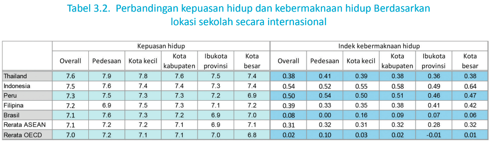

Secara internasional, kemampuan membaca siswa perempuan selalu lebih tinggi dibandingkan dengan siswa laki-laki.

Dapat disimpulkan pula adanya perbedaan kualitas pendidikan yang cukup besar antara
wilayah di Indonesia. Pada PISA 2018, nilai rata-rata kemampuan membaca siswa PISA di DKI Jakarta dan Yogyakarta sekitar 411. Sementara nilai rata-rata Indonesia hanya mencapai 371

Ketidaksetaraan dalam kualitas pendidikan juga terjadi antara sekolah yang terletak di pedesaan dan sekolah sekolah di kota, terutama di ibu kota provinsi dan kota-kota besar.

Kesejahteraan dan sikap belajar siswa di Indonesia lebih erat berkaitan dengan faktor-faktor individu siswa dibandingkan dengan faktor sekolah

Secara internasional, dalam skala 10, nilai rata-rata kepuasan hidup siswa yang bersekolah di pedesaan adalah 7,5 dan di perkotaan 7,3

Perbandingan kepuasan hidup siswa sekolah di desa dan di perkotaan
