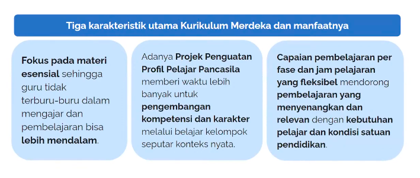
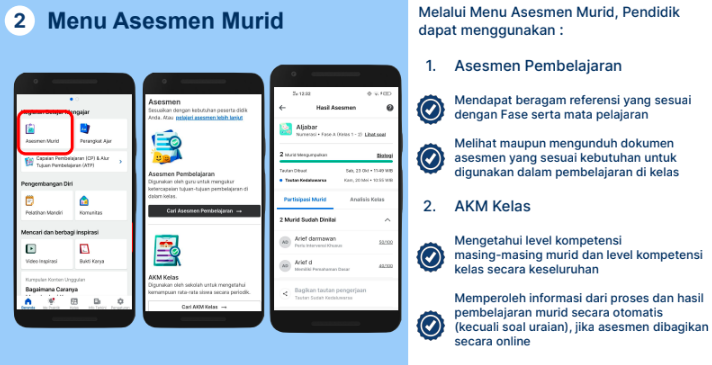
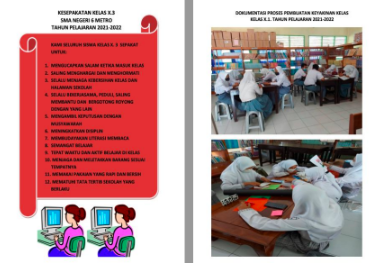
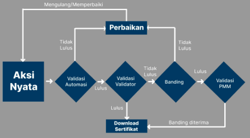

Pemateri: M. Nur Qadri S.
[Tugas Resume Sigit Khoirul Anam]

Kurikulum merdeka bertujuan membentuk siswa menjadi pembelajar sepanjang hayat yang kompeten dan berkarakter pancasila. 

Karakteristik utama kurikulum merdeka belajar

platform merdeka mengajar membantu guru dalam mendapatkan referensi, inspirasi, dan pemahaman untuk menerapkan kurikulum merdeka.

memuat tiga komponen: Mengajar berupa kegiatan belajar mengajar; Belajar berupa pengembangan diri; Berkarya berupa mencari dan berbagi inspirasi. 

dapat diakses melalui mobile app atau laman situs. umumnya untuk masuk kedalam platform tersebut menggunakan email belejar.id tetapi juga bisa dieksplor tanpa akun akun tersebut, sedikit ada batasan. 

dalam platform tersebut tersedia **asesmen murif** untuk melakukan analisis awal pembelajaran literasi dan numerasi. pada bagian **bukti karya** merupakan tempat untuk membangun portofolio karya agar saling berbagi inspirasi dengan sesama rekan pendidik.

### Aksi nyata
setelah menonton dan menyelesaikan post test dari setiap topik pada pelatihan mandiri, maka PTK akan diminta untuk mengunggah aksi nyata. aksi nyata adalah bentuk refleksi dari pemahaman tiap topik pada pelatihan mandiri. sebagai bentuk apresiasi, setiap aksi nyata yang diunggah dan telah sesuai panduan yang ditetapkan, maka PTK akan mendapatkan sertifikat. 

contoh: 
alur validasi: 